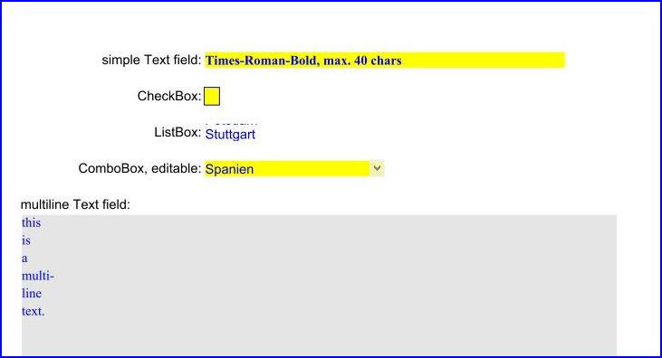
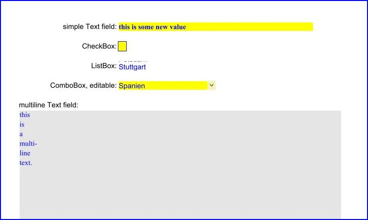

.. _FAQ:

==============================
Collection of Recipes
==============================

A collection of recipes in "How-To" format for using PyMuPDF. We aim to extend this section over time. Where appropriate we will refer to the corresponding `Wiki <https://github.com/rk700/PyMuPDF/wiki>`_ pages, but some duplication may still occur.

----------

Images
-------

----------

How to Increase :index:`Image Resolution <pair: image; resolution>`
~~~~~~~~~~~~~~~~~~~~~~~~~~~~~~~~~~~~~~~~~~~~~~~~~~~~~~~~~~~~~~~~~~~~

The image of a document page is represented by a :ref:`Pixmap`, and the simplest way to create a pixmap is via method :meth:`Page.getPixmap`.

This method has many options for influencing the result. The most important among them is the :ref:`Matrix`, which lets you :index:`zoom`, rotate, distort or mirror the outcome.

:meth:`Page.getPixmap` by default will use the :ref:`Identity` matrix, which does nothing.

In the following, we apply a :index:`zoom factor <pair: resolution;zoom>` of 2 to each dimension, which will generate an image with a four times better resolution for us.

>>> zoom_x = 2.0                       # horizontal zoom: 200%
>>> zoom_y = 2.0                       # vertical zoom: 200%
>>> mat = fitz.Matrix(zoom_x, zoom_y)  # zoom factor 2 in each dimension
>>> pix = page.getPixmap(matrix = mat) # use 'mat' instead of the identity matrix

The resulting pixmap will be 4 times bigger than normal. Zoom factors can be any positive float.

----------

How to Create :index:`Partial Pixmaps` (Clips)
~~~~~~~~~~~~~~~~~~~~~~~~~~~~~~~~~~~~~~~~~~~~~~~~~~~~~~~
You do not always need the full image of a page. This may be the case e.g. when you display the image in a GUI and would like to show an enlarged part.

Let's assume your GUI window has room to display a full document page, but you now want to fill this room with the bottom right quarter of it, thus using a four times higher resolution.

.. image:: img-clip.jpg
   :align: center
   :scale: 80

>>> mat = fitz.Matrix(2, 2)                  # zoom factor 2 in each direction
>>> rect = page.rect                         # page rectangle
>>> mp = rect.tl + (rect.br - rect.tl) * 0.5 # center of rect
>>> clip = fitz.Rect(mp, rect.br)            # clipping area we want
>>> pix = page.getPixmap(matrix = mat, clip = clip)

In the above we construct ``clip`` by specifying two diagonally opposite points: the middle point ``mp`` of the page rectangle, and its bottom right, ``rect.br``.

Also have a look at `this <https://github.com/JorjMcKie/PyMuPDF-Utilities/blob/master/doc-browser.py>`_ script, which has an integrated zooming feature.

----------

How to :index:`Suppress <pair: suppress; annotation>` Annotation Images
~~~~~~~~~~~~~~~~~~~~~~~~~~~~~~~~~~~~~~~~~~~~~~~~~~~~~~~~~~~~~~~~~~~~~~~~
Normally, the pixmap of a page also includes the images of any annotations. There currently is no direct way to suppress this.

But it can be achieved using a little circumvention like in `this <https://github.com/JorjMcKie/PyMuPDF-Utilities/blob/master/show-no-annots.py>`_ script.

----------

.. index::
   triple: extract;image;non-PDF
   single: convertToPDF

How to Extract Images: Non-PDF Documents
~~~~~~~~~~~~~~~~~~~~~~~~~~~~~~~~~~~~~~~~~~~~~~~~~~~~~~~~~~~~~~~~~~~~~~~~~

You can extract images from **any document** in one of the following two ways.

1. Convert your document to a PDF, and then use any of the PDF-only extraction methods. This snippet will convert a document to a memory-resident, temporary PDF, which you can use for this:

    >>> pdfbytes = doc.convertToPDF()
    >>> pdf = fitz.open("pdf", pdfbytes)
    >>> # now use 'pdf' like any PDF document

2. Use :meth:`Page.getText` with the "dict" parameter. This will extract all text and images shown on the page, formatted as a Python dictionary. Every image will occur in an image block, containing meta information and the binary image data. For details of the dictionary's structure, see :ref:`TextPage`. This snippet creates a list of all images shown on a page:

    >>> d = page.getText("dict")
    >>> blocks = d["blocks"]
    >>> imgblocks = [b for b in blocks if b["type"] == 1]

    .. note:: Of course you can use this method for PDFs, too!

----------

.. index::
   triple: extract;image;PDF
   single: extractImage

How to Extract Images: PDF Documents
~~~~~~~~~~~~~~~~~~~~~~~~~~~~~~~~~~~~~~~~~~~~~~~~~~~~~~~~~~~~~~~~~~~~

Like any other "object" in a PDF, embedded images are identified by a cross reference number (xref, a positive integer). If you know this number, you have two ways to access the image's data. The following assumes you have opened a PDF under the name "doc":

1. Create a :ref:`Pixmap` of the image with instruction ``pix = fitz.Pixmap(doc, xref)``. This method is **very** fast (single digit micro-seconds). The pixmap's properties (width, height, ...) will reflect the ones of the image. As usual, you can save it as a PNG via method :meth:`Pixmap.writePNG` (or get the corresponding binary data :meth:`Pixmap.getPNGData`). There is no way to tell which image format the embedded original has.

2. Extract the image with instruction ``img = doc.extractImage(xref)``. This is a dictionary containing the binary image data as ``img["image"]``. A number of meta data are also provided - mostly the same as you would find in the pixmap of the image. The major difference is string ``img["ext"]``, which specifies the image format: apart from "png", strings like "jpeg", "bmp", "tiff", etc. can also occur. Use this string as the file extension if you want to store the image. The execution speed of this method should be compared to the combined speed of the statements ``pix = fitz.Pixmap(doc, xref);pix.getPNGData()``. If the embedded image is in PNG format, the speed of :meth:`Document.extractImage` is about the same (and the binary image data is identical). For other image types, :meth:`Document.extractImage` is **many thousands of times faster** than the pixmap-based method , and in most cases its **image data is much smaller**, too.

The question remains: **"How do I know those cross reference numbers 'xref' of images?"**. There are two answers to this:

a. **"Inspect the page objects"** Loop through the document's page number list and execute :meth:`Document.getPageImageList` for each page number. The result is a list of list, and its items look like ``[xref, smask, ...]``, containing the xref of an image shown on that page. This xref can then be used with one of the above methods. Use this method for **valid (undamaged)** documents. Be wary however, that the same image may be referenced multiple times (by different pages), so you might want to provide a mechanism avoiding multiple extracts.
b. **"No need to know"** Loop through the list of **all xrefs** of the document and perform a :meth:`Document.extractImage` for each xref. If the returned dictionary is empty, then continue -- this xref is no image. Use this method if the PDF is **damaged (unusable pages)**. Note that a PDF often contains "pseudo-images" ("stencil masks") with the special purpose to specify the transparency of some other image. You may want to provide logic to exclude those from extraction. Also have a look at the next section.

For both extraction approaches, there exist ready-to-use general purpose scripts:

`extract-imga.py <https://github.com/JorjMcKie/PyMuPDF-Utilities/blob/master/extract-imga.py>`_ extracts images by page:

.. image:: img-extract-imga.jpg
   :align: center
   :scale: 80

and `extract-imgb.py <https://github.com/JorjMcKie/PyMuPDF-Utilities/blob/master/extract-imgb.py>`_ extracts images by cross reference number:

.. image:: img-extract-imgb.jpg
   :align: center
   :scale: 80

----------

How to Handle Stencil Masks
~~~~~~~~~~~~~~~~~~~~~~~~~~~~~~~~~~~~~
Some images in PDFs are accompanied by **stencil masks**. In their simplest form stencil masks represent alpha (transparency) bytes stored as seperate images. In order to reconstruct the original of an image which has a stencil mask, it must be "enriched" with transparency bytes taken from its stencil mask.

Whether an image does have such a stencil mask can be recognized in one of two ways in PyMuPDF:

1. An item of :meth:`Document.getPageImageList` has the general format ``[xref, smask, ...]``, where ``xref`` is the image's cross reference number and ``smask``, if positive, is the cross reference number of a stencil mask.
2. The (dictionary) results of :meth:`Document.extractImage` have a key ``"smask"``, which also contains any stencil mask's cross reference number if positive.

If ``smask == 0`` then the image encountered via xref can be processed as it is.

To recover the original image using PyMuPDF, the procedure depicted as follows must be executed:

.. image:: img-stencil.jpg
   :align: center
   :scale: 60

>>> pix1 = fitz.Pixmap(doc, xref)    # (1) pixmap of image w/o alpha
>>> pix2 = fitz.Pixmap(doc, smask)   # (2) stencil pixmap
>>> pix = fitz.Pixmap(pix1)          # (3) copy of pix1, empty alpha channel added
>>> pix.setAlpha(pix2.samples)       # (4) fill alpha channel

Step (1) creates a pixmap of the "netto" image. Step (2) does the same with the stencil mask. Please note that the :attr:`Pixmap.samples` attribute of ``pix2`` contains the alpha bytes that must be stored in the final pixmap. This is what happens in step (3) and (4).

The scripts `extract-imga.py <https://github.com/JorjMcKie/PyMuPDF-Utilities/blob/master/extract-imga.py>`_, and `extract-imgb.py <https://github.com/JorjMcKie/PyMuPDF-Utilities/blob/master/extract-imgb.py>`_ above also contain this logic.

----------

.. index::
   triple: picture;embed;PDF
   single: showPDFpage;insertImage;embeddedFileAdd

How to Make a PDF of All your Pictures
~~~~~~~~~~~~~~~~~~~~~~~~~~~~~~~~~~~~~~~~~~~~~~~~~~~~~~~~~~~~~~~~~~~~~~~~~~~~~~
We show here **three scripts** that take a list of (image and other) files and put them all in one PDF.

**Method 1: Inserting Images as Pages**

The first one converts each image to a PDF page with the same dimensions::

 import os, fitz
 import PySimpleGUI as psg                    # for showing progress bar
 doc = fitz.open()                            # PDF with the pictures
 imgdir = "D:/2012_10_05"                     # where the pics are
 imglist = os.listdir(imgdir)                 # list of them
 imgcount = len(imglist)                      # pic count
 
 for i, f in enumerate(imglist):
     img = fitz.open(os.path.join(imgdir, f)) # open pic as document
     rect = img[0].rect                       # pic dimension
     pdfbytes = img.convertToPDF()            # make a PDF stream
     img.close()                              # no longer needed
     imgPDF = fitz.open("pdf", pdfbytes)      # open stream as PDF
     page = doc.newPage(width = rect.width,   # new page with ...
                        height = rect.height) # pic dimension
     page.showPDFpage(rect, imgPDF, 0)        # image fills the page
     psg.EasyProgressMeter("Import Images",   # show our progress
         i+1, imgcount)
 
 doc.save("all-my-pics.pdf")

This will generate a PDF only marginally larger than the combined pictures' size. Some numbers on performance:

The above script needed about 1 minute on my machine for 149 pictures with a total size of 514 MB (and about the same resulting PDF size).

.. image:: img-import-progress.jpg
   :align: center
   :scale: 80

Look `here <https://github.com/JorjMcKie/PyMuPDF-Utilities/blob/master/all-my-pics-inserted.py>`_ for a more complete source code: it offers a directory selection dialog and skips unsupported files and non-file entries.

.. note:: We could have used :meth:`Page.insertImage` instead of :meth:`Page.showPDFpage`, and the result would have been a similar looking file. However, depending on the image type, it may store **images uncompressed**. Therefore, the save option ``deflate = True`` must be used to achieve a reasonable file size, which hugely increases the runtime for large numbers of images. So this alternative **cannot be recommended** here.

**Method 2: Embedding Files**

The second script **embeds** the (image) files. You would need a suitable PDF viewer that can display and / or extract embedded files::

 import os, fitz
 import PySimpleGUI as psg                    # for showing progress bar
 doc = fitz.open()                            # PDF with the pictures
 imgdir = "D:/2012_10_05"                     # where the pictures are
 
 imglist = os.listdir(imgdir)                 # list of pictures
 imgcount = len(imglist)                      # pic count
 imglist.sort()                               # nicely sort them

 for i, f in enumerate(imglist):
     img = open(os.path.join(imgdir,f), "rb").read()    # make pic stream
     doc.embeddedFileAdd(img, f, filename=f,            # and embed it
                         ufilename=f, desc=f)
     psg.EasyProgressMeter("Embedding Files", # show our progress
         i+1, imgcount)
 
 page = doc.newPage()                         # at least 1 page is needed,
 
 doc.save("all-my-pics-embedded.pdf")

.. image:: img-embed-progress.jpg
   :align: center
   :scale: 80

This is by far the fastest method, and it also produces the smallest possible output file size. The above pictures needed 20 seonds on my machine and yielded a PDF size of 510 MB. Look `here <https://github.com/JorjMcKie/PyMuPDF-Utilities/blob/master/all-my-pics-embedded.py>`_ for a more complete source code: it offers a direcory selection dialog and skips non-file entries.

**Method 3: Attaching Files**

A third way to achieve this task is **attaching files** via page annotations see `here <https://github.com/JorjMcKie/PyMuPDF-Utilities/blob/master/all-my-pics-attached.py>`_ for the complete source code.

This has a similar performance as the previous script and it also produces a similar file size. In this example, we have chosen a small page size to demonstrate the automatic generation of "protocol" pages as necessary. Here is the first page:

.. image:: img-attach-result.jpg
   :align: center

.. note:: Both, the **embed** and the **attach** methods can be used for **arbitrary files** - not just images.

.. note:: We strongly recommend using the awesome package `PySimpleGUI <https://pypi.org/project/PySimpleGUI/>`_ to display a progress meter for tasks that may run for an extended time span. It's pure Python, uses Tkinter (no additional GUI package) and requires just one more line of code!

----------

.. index::
   triple: vector;image;SVG
   single: showPDFpage
   single: insertImage
   single: embeddedFileAdd

How to Create Vector Images
~~~~~~~~~~~~~~~~~~~~~~~~~~~~~~~~~~~~~~~~~~~~~~~~~~~~~~~~~~~~~~~~~
The usual way to create an image from a document page is :meth:`Page.getPixmap`. A pixmap represents a raster image, so you must decide on its quality (i.e. resolution) at creation time. It cannot be increased later.

PyMuPDF also offers a way to create a **vector image** of a page in SVG format (scalable vector graphics, defined in XML syntax). SVG images remain precise across zooming levels - of course with the exception of any embedded raster graphic elements.

Instruction ``svg = page.getSVGimage(matrix = fitz.Identity)`` delivers a UTF-8 string ``svg`` which can be stored with extension ".svg".

----------

Text
-----

----------

.. index::
   triple: extract;text;rectangle

How to Extract Text from within a Rectangle
~~~~~~~~~~~~~~~~~~~~~~~~~~~~~~~~~~~~~~~~~~~~~~~~~~~~~~~~~~~~~~~~~~~~~~~~~~~~~~~~~~~~~
Please refer to this `Wiki page <https://github.com/rk700/PyMuPDF/wiki/How-to-extract-text-from-a-rectangle>`_ of the repository.

----------

.. index::
    pair: text;reading order

How to Extract Text in Natural Reading Order
~~~~~~~~~~~~~~~~~~~~~~~~~~~~~~~~~~~~~~~~~~~~~~~~~~~~~~~~~~~~~~~~~~~~~~~~~~~~~~~~~~

One of the common issues with PDF text extraction is, that text may not appear in any particular reading order.

Responsible for this effect is the PDF creator (software or human). For example, page headers may have been inserted in a separate step - after the document had been produced. In such a case, the header text will appear at the end of a page text extraction (allthough it will be correctly shown by PDF viewer software).

PyMuPDF has several means to re-establish some reading sequence or even to re-generate a layout close to the original.

As a starting point take the above mentioned `script <https://github.com/rk700/PyMuPDF/wiki/How-to-extract-text-from-a-rectangle>`_ and then use the full page rectangle.

----------

How to :index:`Extract Tables <pair: extract; table>` from Documents
~~~~~~~~~~~~~~~~~~~~~~~~~~~~~~~~~~~~~~~~~~~~~~~~~~~~~~~~~~~~~~~~~~~~~~
If you see a table in a document, you are not normally looking at something like an embedded Excel or other identifyable object. It usually is just text, formatted to appear as appropriate.

Extracting a tabular data from such a page area therefore means that you must find a way to **(1)** graphically indicate table and column borders, and **(2)** then extract text based on this information.

The wxPython GUI script `wxTableExtract.py <https://github.com/rk700/PyMuPDF/blob/master/examples/wxTableExtract.py>`_ strives to exactly do that. You may want to have a look at it and adjust it to your liking.

----------

How to Search for and Mark Text
~~~~~~~~~~~~~~~~~~~~~~~~~~~~~~~~
There is a standard search function to search for arbitrary text on a page: :meth:`Page.searchFor`. It returns a list of :ref:`Rect` objects which surround a found occurrence. These rectangles can for example be used to automatically insert annotations which visibly mark the found text.

This method has advantages and drawbacks. Pros are

* the search string can contain blanks and wrap across lines
* upper or lower cases are treated equal

Disadvantages:

* you cannot determine the number of found items beforehand: if ``hit_max`` rectangles are returned you do not know if and how many more you may have missed.

But you have other options::

 import sys
 import fitz
 
 def mark_word(page, text):
     """Underline each word that contains 'text'.
     """
     found = 0
     wlist = page.getTextWords()        # make the word list
     for w in wlist:                    # scan through all words on page
         if text in w[4]:               # w[4] is the word's string
             found += 1                 # count
             r = fitz.Rect(w[:4])       # make rect from word bbox
             page.addUnderlineAnnot(r)  # underline
     return found
 
 fname = sys.argv[1]                    # filename
 text = sys.argv[2]                     # search string
 doc = fitz.open(fname)

 print("underlining words containing '%s' in document '%s'" % (word, doc.name))

 new_doc = False                        # indicator if anything found at all

 for page in doc:                       # scan through the pages
     found = mark_word(page, text)      # mark the page's words
     if found:                          # if anything found ...
         new_doc = True
         print("found '%s' %i times on page %i" % (text, found, page.number + 1))
 
 if new_doc:
     doc.save("marked-" + doc.name)

This script uses :meth:`Page.getTextWords` to look for a string, handed in via cli parameter. This method separates a page's text into "words" using spaces and line breaks as delimiters. Therefore the words in this lists contain no spaces or line breaks. Further remarks:

* If found, the **complete word containing the string** is marked (underlined) -- not only the search string.
* The search string may **not contain spaces** or other white space.
* As shown here, upper / lower cases are **respected**. But this can be changed by using the string method ``lower()`` (or even regular expressions) in function ``mark_word``.
* There is **no upper limit**: all occurrences will be detected.
* You can use **anything** to mark the word: 'Underline', 'Highlight', 'StrikeThrough' or 'Square' annotations, etc.
* Here is an example snippet of a page of this manual, where "MuPDF" has been used as the search string. Note that all string **containing "MuPDF"** have been underlined.

.. image:: img-markedpdf.jpg
   :align: center
   :scale: 60

----------

General
--------

How to Open with :index:`a Wrong File Extension <pair: wrong; file extension>`
~~~~~~~~~~~~~~~~~~~~~~~~~~~~~~~~~~~~~~~~~~~~~~~~~~~~~~~~~~~~~~~~~~~~~~~~~~~~~~~~~
If you have a document which does not have the right file extension for its type, you can still correctly open it.

Assume that "some.file" is actually an XPS. Open it like so:

>>> doc = fitz.open("some.file", filetype = "xps")

.. note:: MuPDF itself does not try to determine the file type from the file data. You are responsible for supplying it in some way - either implicitely via the file extension, or explicitely as shown. Also consult the :ref:`Document` chapter for a full description.

----------

How to :index:`Embed or Attach Files <triple: attach;embed;file>`
~~~~~~~~~~~~~~~~~~~~~~~~~~~~~~~~~~~~~~~~~~~~~~~~~~~~~~~~~~~~~~~~~~
PDF supports incorporating arbitrary data. This can be done in one of two ways: "embedding" or "attaching". PyMuPDF supports both options.

1. Attached Files: data are **attached to a page** by way of a *FileAttachment* annotation with this statement: ``annot = page.addFileAnnot(pos, ...)``, for details see :meth:`Page.addFileAnnot`. The first parameter "pos" is the :ref:`Point`, where a "PushPin" icon should be placed on the page.

2. Embedded Files: data are embedded on the **document level** via method :meth:`Document.embeddedFileAdd`.

The basic differences between these options are **(1)** you need edit permission to embed a file, but only annotation permission to attach, **(2)** like all annotations, attachments are visible on a page, embedded files are not.

There exist several example scripts: `embedded-list.py <https://github.com/rk700/PyMuPDF/blob/master/examples/embedded-list.py>`_, `new-annots.py <https://github.com/rk700/PyMuPDF/blob/master/demo/new-annots.py>`_.

Also look at the sections above and at chapter :ref:`Appendix 3`.

----------

.. index::
   pair: delete;pages
   pair: rearrange;pages

How to Delete and Re-Arrange Pages
~~~~~~~~~~~~~~~~~~~~~~~~~~~~~~~~~~~~~~
With PyMuPDF you have all options to copy, move, delete or re-arrange the pages of a PDF. Intuitive methods exist that allow you to do this on a page-by-page level, like the :meth:`Document.copyPage` method.

Or you alternatively prepare a complete new page layout in form of a Python sequence, that contains the page numbers you want, in the sequence you want, and as many times as you want each page. The following illustrates what can be done with :meth:`Document.select`:

``doc.select([1, 1, 1, 5, 4, 9, 9, 9, 0, 2, 2, 2])``

Now let's prepare a PDF for double-sided printing (on a printer not directly supporting this):

The number of pages is given by ``len(doc)`` (equal to ``doc.pageCount``). The following lists represent the even and the odd page numbers, respectively:

>>> p_even = [p in range(len(doc)) if p % 2 == 0]
>>> p_odd  = [p in range(len(doc)) if p % 2 == 1]

This snippet creates the respective sub documents which can then be used to print the document:

>>> doc.select(p_even)    # only the even pages left over
>>> doc.save("even.pdf")  # save the "even" PDF
>>> doc.close()           # recycle the file
>>> doc = fitz.open(doc.name) # re-open
>>> doc.save(p_odd)       # and do the same with the odd pages
>>> doc.save("odd.pdf")

For more information also have a look at this Wiki `article <https://github.com/rk700/PyMuPDF/wiki/Rearranging-Pages-of-a-PDF>`_.

----------

How to Join PDFs 
~~~~~~~~~~~~~~~~~~
It is easy to join PDFs with method :meth:`Document.insertPDF`. Given open PDF documents, you can copy page ranges from one to the other. You can select the point where the copied pages should be placed, you can revert the page sequence and also change page rotation. This Wiki `article <https://github.com/rk700/PyMuPDF/wiki/Inserting-Pages-from-other-PDFs>`_ contains a full description.

The GUI script `PDFjoiner.py <https://github.com/rk700/PyMuPDF/blob/master/examples/PDFjoiner.py>`_ uses this method to join a list of files while also joining the respective table of contents segments. It looks like this:

.. image:: img-pdfjoiner.jpg
   :scale: 60
   :align: center

----------

How to Add Pages
~~~~~~~~~~~~~~~~~~
There two methods for adding new pages to a PDF: :meth:`Document.insertPage` and :meth:`Document.newPage` (and they share a common code base).

**newPage**

:meth:`Document.newPage` returns the created :ref:`Page` object. Here is the constructor showing defaults::

 >>> doc = fitz.open(...)              # some new or existing PDF document
 >>> page = doc.newPage(to = -1,       # insertion point: end of document
                        width = 595,   # page dimension: A4 portrait
                        height = 842)

The above could also have been achieved with the short form ``page = doc.newPage()``. The ``to`` parameter specifies the document's page number (0-based) **in front of which** to insert.

To create a page in *landscape* format, just exchange the width and height values.

Use this to create the page with another pre-defined paper format:

>>> w, h = fitz.PaperSize("letter-l")        # 'Letter' landscape
>>> page = doc.newPage(width = w, height = h)

The convenience function :meth:`PaperSize` knows over 40 industry standard paper formats to choose from. To see them, inspect dictionary :attr:`paperSizes`. Pass the desired dictionary key to :meth:`PaperSize` to retrieve the paper dimensions. Upper and lower case is supported. If you append "-L" to the format name, the landscape version is returned.

.. note:: Here is a 3-liner that creates a PDF with one empty page. Its file size is 470 bytes:

   >>> doc = fitz.open()
   >>> doc.newPage()
   >>> doc.save("A4.pdf")

**insertPage**

:meth:`Document.insertPage` also inserts a new page and accepts the same parameters ``to``, ``width`` and ``height``. But it lets you also insert arbitrary text into the new page and returns the number of inserted lines::

 >>> doc = fitz.open(...)              # some new or existing PDF document
 >>> n = doc.insertPage(to = -1,       # default insertion point
                        text = None,   # string or sequence of strings
                        fontsize = 11,
                        width = 595,
                        height = 842,
                        fontname = "Helvetica", # default font
                        fontfile = None,        # any font file name
                        color = (0, 0, 0))      # text color (RGB)

The text parameter can be a (sequence of) string (assuming UTF-8 encoding). Insertion will start at :ref:`Point` (50, 72), which is one inch below top of page and 50 points from the left. The number of inserted text lines is returned. See the method definiton for more details.

----------

How To Dynamically Clean Up Corrupt PDFs
~~~~~~~~~~~~~~~~~~~~~~~~~~~~~~~~~~~~~~~~~

This shows a potential use of PyMuPDF with another Python PDF library (the excellent pure Python package `pdfrw <https://pypi.python.org/pypi/pdfrw>`_ is used here as an example).

If a clean, non-corrupt / decompressed / decrypted PDF is needed, one could dynamically invoke PyMuPDF to recover from many problems like so::

 import sys
 from io import BytesIO
 from pdfrw import PdfReader
 import fitz
 
 #---------------------------------------
 # 'Tolerant' PDF reader
 #---------------------------------------
 def reader(fname, password = None):
     idata = open(fname, "rb").read()        # read the PDF into memory and
     ibuffer = BytesIO(idata)                # convert to stream
     if password is None:
         try:
             return PdfReader(ibuffer)       # if this works: fine!
         except:
             pass
     del ibuffer                             # free some storage
     # either we need a password or it is a problem-PDF
     # create a repaired / decrypted version
     doc = fitz.open("pdf", idata)
     if password is not None:                # decrypt if password provided
         doc.authenticate(password)
     c = doc.write(garbage=4)
     del doc                                 # close & delete doc
     return PdfReader(BytesIO(c))            # let pdfrw retry
 #---------------------------------------
 # Main program
 #---------------------------------------
 pdf = reader("pymupdf.pdf", password = None) # inlude a password if necessary
 print pdf.Info
 # do further processing

With the command line utility ``pdftk`` (`available <https://www.pdflabs.com/tools/pdftk-the-pdf-toolkit/>`_ for Windows only, but reported to also run under `Wine <https://www.winehq.org/>`_) a similar result can be achieved, see `here <http://www.overthere.co.uk/2013/07/22/improving-pypdf2-with-pdftk/>`_. However, you must invoke it as a separate process via ``subprocess.Popen``, using stdin and stdout as communication vehicles.

----------

.. index::
   pair: reflowable;document
   pair: reflowable;bookmark

How To Deal with Reflowable Documents
~~~~~~~~~~~~~~~~~~~~~~~~~~~~~~~~~~~~~~~~~
Some document types have no fixed layout. People using an e-book reader will know this, but every internet browser is also capable of re-layouting a web site (changing app window, font size changes, ...). Such documents are called "reflowable".

PyMuPDF supports this in the following way:

1. A reflowable document's layout can be set when opening it -- via parameters ``"rect"``, ``"width"``, ``"height"`` and ``"fontsize"``.

2. Any time later, the document can be re-layouted using :meth:`Document.layout`. Page numbers can be tracked across this process.

    * ``bm = doc.makeBookmark(pno)`` creates a "bookmark" for any current page number ``pno``.

    * after re-layouting, :meth:`Document.findBookmark` returns its new number::

        In [1]: import fitz
        In [2]: doc = fitz.open("some.epub")      # a reflowable document
        In [3]: len(doc)                          # current number of pages
        Out[3]: 251
        In [4]: doc[0].rect                       # check old size of some page
        Out[4]: fitz.Rect(0.0, 0.0, 450.0, 600.0)
        In [5]: bm1 = doc.makeBookmark(150)       # bookmark page 150
        In [6]: bm2 = doc.makeBookmark(-1)        # bookmark last page
        In [7]: doc.layout(width=600, height=800) # change the layout
        In [8]: len(doc)                          # new number of pages
        Out[8]: 133
        In [9]: doc[0].rect                       # check page size again
        Out[9]: fitz.Rect(0.0, 0.0, 600.0, 800.0)
        In [10]: doc.findBookmark(bm1)            # new number for page 150
        Out[10]: 78
        In [11]: doc.findBookmark(bm2)            # new number for last page
        Out[11]: 132

.. note:: The term "bookmark" in this context has nothing to do with :attr:`Document.outline` or entries in the table of contents list, which are sometimes also called bookmarks. Layout bookmarks are short-lived, internally calculated integers (*long* in Python 2), which must not be changed in any way.

----------

.. index::
   pair: widget;form fields

How To Deal with PDF Form Fields
~~~~~~~~~~~~~~~~~~~~~~~~~~~~~~~~~~~~~~~~~
PDFs can be used as fillable forms: certain fields ("form fields", or "widgets") can be made editable while the rest of the document remains change-protected (technically, form fields are a special type of :ref:`Annot`). PyMuPDF supports this feature in the following way:

* one can detect whether a PDF contains any widgets: :attr:`Document.isFormPDF`
* existing widgets can be changed (:meth:`Annot.updateWidget`) in almost every aspect like colors, text font, location on page, boundary, value, etc.
* widgets can be deleted (:meth:`Page.deleteAnnot`)
* widgets can added via :meth:`Page.addWidget`

Form fields have **many** properties, and they also come in handful of different sub types. We have therefore decided to use a new class :ref:`Widget` as a parameter for creating and updating widgets (as opposed to bloating these methods with dozens of arguments). This `script <https://github.com/JorjMcKie/PyMuPDF-Utilities/blob/master/form-fields.py>`_ creates a new PDF with a number of form fields. All of them are also given initial values. The result looks like this:

Now let's change the value of one of these fields:

>>> import fitz
>>> doc = fitz.open("widgettest.pdf")
>>> page = doc[0]                         # the page containing the field
>>> annot = page.firstAnnot               # the annot representing the field
>>> widget = annot.widget                 # object containing all field properties
>>> widget.field_value                    # look at current value
'Times-Roman-Bold, max. 40 chars'
>>> widget.field_value = "this is some new value"  # change the value
>>> annot.updateWidget(widget)            # update the field
>>> doc.saveIncr()                        # save PDF incrementally

Checking the result:

.. note:: To locate the right form field (the above situation in lines 3 and 4 is somewhat idealistic), you can use :attr:`Widget.field_name` -- which is not necessarily unique however. Annotations on a page are a forward linked chain: each annotation has a :attr:`Annot.next` property which is either ``None`` or points to the next annotation. So if you know the page number and the field name, you could do this:

>>> import fitz
>>> doc = fitz.open("widgettest.pdf")
>>> page = doc[n]                         # locate the page
>>> annot = page.firstAnnot               # scan through its annots
>>> widget = None                         # prepare for not-found
>>> while annot:
        widget = annot.widget             # None if not a field
        if widget and widget.field_name == "textfield-1":
            break                         # found it!
        annot = annot.next                # try next one
>>> # check if we found the field
>>> if not widget or widget.field_name != "textfield-1":
        raise ValueError("field not found")
>>> # work with the widget

