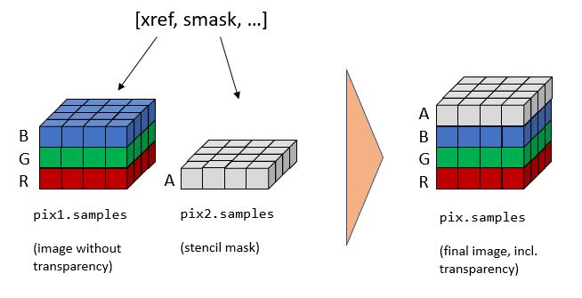
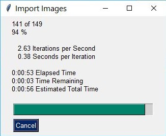
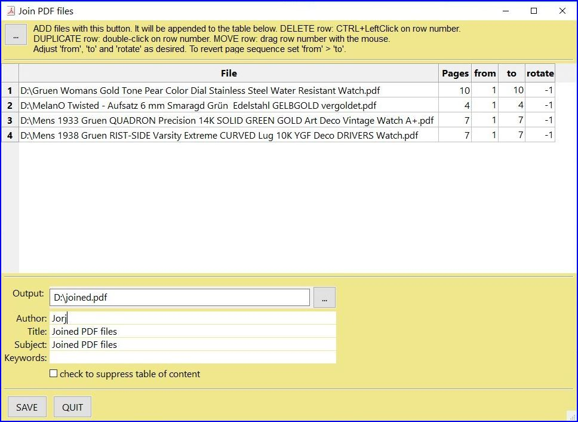

.. _FAQ:

==============================
Collection of Recipes
==============================

.. highlight:: python

A collection of recipes in "How-To" format for using PyMuPDF. We aim to extend this section over time. Where appropriate we will refer to the corresponding `Wiki <https://github.com/rk700/PyMuPDF/wiki>`_ pages, but some duplication may still occur.

----------

Images
-------

----------

How to Make Images from Document Pages
~~~~~~~~~~~~~~~~~~~~~~~~~~~~~~~~~~~~~~~~~~~~~~~~~~~~~~~~~~~~~~~~~~~~

This little script will take a document filename and generate a PNG file from each of its pages.

The document can be any supported type like PDF, XPS, etc.

The script works as a command line tool which expects the filename being supplied as a parameter. The generated image files (1 per page) are stored in the directory of the script::

    import sys, fitz                            # import the binding
    fname = sys.argv[1]                         # get filename from command line
    doc = fitz.open(fname)                      # open document
    for page in doc:                            # iterate through the pages
        pix = page.getPixmap(alpha = False)     # render page to an image
        pix.writePNG("page-%i.png" % page.number)    # store image as a PNG

The script directory will now contain PNG image files named ``page-0.png``, ``page-1.png``, etc. Pictures have the dimension of their pages, e.g. 596 x 842 pixels for an A4 portrait sized page. They will have a resolution of 96 dpi in x and y dimension and have no transparency. You can change all that -- for how to do do this, read the next sections.

----------

How to Increase :index:`Image Resolution <pair: image; resolution>`
~~~~~~~~~~~~~~~~~~~~~~~~~~~~~~~~~~~~~~~~~~~~~~~~~~~~~~~~~~~~~~~~~~~~

The image of a document page is represented by a :ref:`Pixmap`, and the simplest way to create a pixmap is via method :meth:`Page.getPixmap`.

This method has many options for influencing the result. The most important among them is the :ref:`Matrix`, which lets you :index:`zoom`, rotate, distort or mirror the outcome.

:meth:`Page.getPixmap` by default will use the :ref:`Identity` matrix, which does nothing.

In the following, we apply a :index:`zoom factor <pair: resolution;zoom>` of 2 to each dimension, which will generate an image with a four times better resolution for us.

>>> zoom_x = 2.0                       # horizontal zoom
>>> zomm_y = 2.0                       # vertical zoom
>>> mat = fitz.Matrix(zoom_x, zomm_y)  # zoom factor 2 in each dimension
>>> pix = page.getPixmap(matrix = mat) # use 'mat' instead of the identity matrix

The resulting pixmap will be 4 times bigger than normal.

----------

How to Create :index:`Partial Pixmaps` (Clips)
~~~~~~~~~~~~~~~~~~~~~~~~~~~~~~~~~~~~~~~~~~~~~~~~~~~~~~~
You do not always need the full image of a page. This may be the case e.g. when you display the image in a GUI and would like to zoom into a part of the page.

Let's assume your GUI window has room to display a full document page, but you now want to fill this room with the bottom right quarter of your page, thus using a four times better resolution.

.. image:: img-clip.jpg
   :scale: 80

>>> mat = fitz.Matrix(2, 2)                  # zoom factor 2 in each direction
>>> rect = page.rect                         # page rectangle
>>> mp = rect.tl + (rect.br - rect.tl) * 0.5 # center of rect
>>> clip = fitz.Rect(mp, rect.br)            # clipping area we want
>>> pix = page.getPixmap(matrix = mat, clip = clip)

In the above we construct ``clip`` by specifying two diagonally opposite points: the middle point ``mp`` of the page rectangle, and its bottom right, ``rect.br``.

----------

How to :index:`Suppress <pair: suppress; annotation>` Annotation Images
~~~~~~~~~~~~~~~~~~~~~~~~~~~~~~~~~~~~~~~~~~~~~~~~~~~~~~~~~~~~~~~~~~~~~~~~
Normally, the pixmap of a page also includes the images of any annotations. There currently is now direct way to suppress this.

But it can be achieved using a little circumvention like in `this <https://github.com/JorjMcKie/PyMuPDF-Utilities/blob/master/show-no-annots.py>`_ script.

----------

.. index::
   triple: extract;image;non-PDF
   single: convertToPDF

How to Extract Images: Non-PDF Documents
~~~~~~~~~~~~~~~~~~~~~~~~~~~~~~~~~~~~~~~~~~~~~~~~~~~~~~~~~~~~~~~~~~~~~~~~~

You have basically two options:

1. Convert your document to a PDF, and then use any of the PDF-only extraction methods. This snippet will convert a document to PDF::

    >>> pdfbytes = doc.convertToPDF()
    >>> pdf = fitz.open("pdf", pdfbytes)
    >>> # now use 'pdf' like any PDF document

2. Use :meth:`Page.getText` with the "dict" parameter. This will extract all text and images shown on the page, formatted as a Python dictionary. Every image will occur in an image block, containing meta information and the binary image data. For details of the dictionary's structure, see :ref:`TextPage`. The method works equally well for PDF files. This creates a list of all images shown on a page::

    >>> d = page.getText("dict")
    >>> blocks = d["blocks"]
    >>> imgblocks = [b for b in blocks if b["type"] == 1]

----------

.. index::
   triple: extract;image;PDF
   single: extractImage

How to Extract Images: PDF Documents
~~~~~~~~~~~~~~~~~~~~~~~~~~~~~~~~~~~~~~~~~~~~~~~~~~~~~~~~~~~~~~~~~~~~

Like any other "object" in a PDF, embedded images are identified by a cross reference number (xref, an integer). If you know this number, you have two ways to access the image's data. The following assumes you have opened a PDF under the name "doc":

1. Create a :ref:`Pixmap` of the image with instruction ``pix = fitz.Pixmap(doc, xref)``. This method is **very** fast (single digit micro-seconds). The pixmap's properties (width, height, ...) will reflect the ones of the image. As usual, you can save it as a PNG via method :meth:`Pixmap.writePNG` (or get the corresponding binary data :meth:`Pixmap.getPNGData`). There is no way to tell which image format the embedded original has.

2. Extract the image with instruction ``img = doc.extractImage(xref)``. This is a dictionary containing the binary image data as ``img["image"]``. A number of meta data are also provided -- mostly the same as you would find in the pixmap of the image. The major difference is string ``img["ext"]``, which specifies the image format: apart from "png", strings like "jpeg", "bmp", "tiff", etc. can also occur. Use this string as the file extension if you want to store the image. The execution speed of this method should be compared to the combined speed of the statements ``pix = fitz.Pixmap(doc, xref);pix.getPNGData()``. If the embedded image is in PNG format, the speed of :meth:`Document.extractImage` is about the same (and the binary image data are identical). Otherwise, this method is **thousands of times faster**, and the **image data is much smaller**.

The question remains: **"How do I know those cross reference numbers 'xref' of images?"**. There are two answers to this:

a. **"Inspect the page objects"** Loop through the document's page number list and execute :meth:`Document.getPageImageList` for each page number. The result is a list of list, and its items look like ``[xref, smask, ...]``, containing the xref of an image shown on that page. This xref can then be used with one of the above methods. Use this method for **valid (undamaged)** documents. Be wary however, that the same image may be referenced multiple times (by different pages), so you might want to provide a mechanism avoiding multiple extracts.
b. **"No need to know"** Loop through the list of **all xrefs** of the document and perform a :meth:`Document.extractImage` for each one. If the returned dictionary is empty, then continue -- this xref is no image. Use this method if the PDF is **damaged (unusable pages)**. Note that a PDF often contains "pseudo-images" ("stencil masks") with the special purpose to specify the transparency of some other image. You may want to provide logic to exclude those from extraction. Also have a look at the next section.

For both extraction approaches, there exist ready-to-use general purpose scripts:

`extract-imga.py <https://github.com/JorjMcKie/PyMuPDF-Utilities/blob/master/extract-imga.py>`_ extracts images by page:

.. image:: img-extract-imga.jpg
   :scale: 80

and `extract-imgb.py <https://github.com/JorjMcKie/PyMuPDF-Utilities/blob/master/extract-imgb.py>`_ extracts images by cross reference number:

.. image:: img-extract-imgb.jpg
   :scale: 80

----------

How to Handle Stencil Masks
~~~~~~~~~~~~~~~~~~~~~~~~~~~~~~~~~~~~~
Some images in PDFs are accompanied by **stencil masks**. In their simplest form stencil masks represent alpha (transparency) bytes stored as seperate images. In order to reconstruct the original of an image which has a stencil mask, it must be "enriched" with transparency bytes taken from its stencil mask.

Whether an image does have such a stencil mask can be recognized in one of two ways in PyMuPDF:

1. An item of :meth:`Document.getPageImageList` has the general format ``[xref, smask, ...]``, where ``xref`` is the image's cross reference number and ``smask``, if positive, is the cross reference number of a stencil mask.
2. The (dictionary) results of :meth:`Document.extractImage` have a key ``"smask"``, which also contains any stencil mask's cross reference number if positive.

If ``smask == 0`` then the image encountered via xref can be processed as it is.

To recover the original image using PyMuPDF, the procedure depicted as follows must be executed:

>>> pix1 = fitz.Pixmap(doc, xref)    # (1) pixmap of image w/o alpha
>>> pix2 = fitz.Pixmap(doc, smask)   # (2) stencil pixmap
>>> pix = fitz.Pixmap(pix1)          # (3) copy of pix1, empty alpha channel added
>>> pix.setAlpha(pix2.samples)       # (4) fill alpha channel

Step (1) creates a pixmap of the "netto" image. Step (2) does the same with the stencil mask. Please note that the :attr:`Pixmap.samples` attribute of ``pix2`` contains the alpha bytes that must be stored in the final pixmap. This is what happens in step (3) and (4).

The scripts `extract-imga.py <https://github.com/JorjMcKie/PyMuPDF-Utilities/blob/master/extract-imga.py>`_, and `extract-imgb.py <https://github.com/JorjMcKie/PyMuPDF-Utilities/blob/master/extract-imgb.py>`_ above also contain this logic.

----------

.. index::
   triple: picture;embed;PDF
   single: showPDFpage;insertImage;embeddedFileAdd

How to Make one PDF of all your Pictures
~~~~~~~~~~~~~~~~~~~~~~~~~~~~~~~~~~~~~~~~~~~~~~~~~~~~~~~~~~~~~~~~~~~~~~~~~~~~~~
We show here **three scripts** that take a list of (image and other) files and put them all in one PDF.

**Method 1: Inserting Images as Pages**

The first one converts each image to a PDF page with the same dimensions::

 import os, fitz
 import PySimpleGUI as psg                    # for showing progress bar
 doc = fitz.open()                            # PDF with the pictures
 imgdir = "D:/2012_10_05"                     # where the pics are
 imglist = os.listdir(imgdir)                 # list of them
 imgcount = len(imglist)                      # pic count
 
 for i, f in enumerate(imglist):
     img = fitz.open(os.path.join(imgdir, f)) # open pic as document
     rect = img[0].rect                       # pic dimension
     pdfbytes = img.convertToPDF()            # make a PDF stream
     img.close()                              # no longer needed
     imgPDF = fitz.open("pdf", pdfbytes)      # open stream as PDF
     page = doc.newPage(width = rect.width,   # new page with ...
                        height = rect.height) # pic dimension
     page.showPDFpage(rect, imgPDF, 0)        # image fills the page
     psg.EasyProgressMeter("Import Images",   # show our progress
         i+1, imgcount)
 
 doc.save("all-my-pics.pdf")

This will generate a PDF only marginally larger than the combined pictures' size. Some numbers on performance:

The above script needed about 1 minute on my machine for 149 pictures with a total size of 514 MB (and about the same resulting PDF size).

Look `here <https://github.com/JorjMcKie/PyMuPDF-Utilities/blob/master/all-my-pics-inserted.py>`_ for a more complete source code: it offers a directory selection dialog and skips unsupported files and non-file entries.

.. note:: We could have used :meth:`Page.insertImage` instead of :meth:`Page.showPDFpage`, and the result would have been a similar looking file. However, depending on the image type, it may store **images uncompressed**. Therefore, the save option ``deflate = True`` must be used to achieve a reasonable file size, which hugely increases the runtime for large numbers of images. So this alternative **cannot be recommended** here.

**Method 2: Embedding Files**

The second script **embeds** the (image) files. You would need a suitable PDF viewer that can display and / or extract embedded files::

 import os, fitz
 import PySimpleGUI as psg                    # for showing progress bar
 doc = fitz.open()                            # PDF with the pictures
 imgdir = "D:/2012_10_05"                     # where the pictures are
 
 imglist = os.listdir(imgdir)                 # list of pictures
 imgcount = len(imglist)                      # pic count
 imglist.sort()                               # nicely sort them

 for i, f in enumerate(imglist):
     img = open(os.path.join(imgdir,f), "rb").read()    # make pic stream
     doc.embeddedFileAdd(img, f, filename=f,            # and embed it
                         ufilename=f, desc=f)
     psg.EasyProgressMeter("Embedding Files", # show our progress
         i+1, imgcount)
 
 page = doc.newPage()                         # at least 1 page is needed,
 
 doc.save("all-my-pics-embedded.pdf")

This is by far the fastest method, and it also produces the smallest possible output file size. The above pictures needed 20 seonds on my machine and yielded a PDF size of 510 MB. Look `here <https://github.com/JorjMcKie/PyMuPDF-Utilities/blob/master/all-my-pics-embedded.py>`_ for a more complete source code: it offers a direcory selection dialog and skips non-file entries.

**Method 3: Attaching Files**

A third way to achieve this task is **attaching files** via page annotations see `here <https://github.com/JorjMcKie/PyMuPDF-Utilities/blob/master/all-my-pics-attached.py>`_ for the complete source code.

This has a similar performance as the previous script and it also produces a similar file size. In this example, we have chosen a small page size to demonstrate the automatic generation of "protocol" pages as necessary. Here is the first page:

.. image:: img-attach-result.jpg

.. note:: Both, the **embed** and the **attach** methods can be used for **arbitrary files** -- not just images.

.. note:: We strongly recommend using the awesome package `PySimpleGUI <https://pypi.org/project/PySimpleGUI/>`_ to display a progress meter for tasks that may run for an extended time span. It's pure Python, uses Tkinter (no additional GUI package) and requires just one more line of code!

----------

.. index::
   triple: vector;image;SVG
   single: showPDFpage
   single: insertImage
   single: embeddedFileAdd

How to Create Vector Images
~~~~~~~~~~~~~~~~~~~~~~~~~~~~~~~~~~~~~~~~~~~~~~~~~~~~~~~~~~~~~~~~~
The usual way to create an image from a document page is :meth:`Page.getPixmap`. A pixmap represents a raster image, so you must decide on its quality (i.e. resolution) at creation time. It cannot be increased later.

PyMuPDF also offers a way to create a **vector image** of a page in SVG format (scalable vector graphics, defined in XML syntax). SVG images remain precise across zooming levels -- of course with the exception of any embedded raster graphic elements.

Instruction ``svg = page.getSVGimage(matrix = fitz.Identity)`` delivers a UTF-8 string ``svg`` which can be stored with extension ".svg".

----------

How to Convert Images
~~~~~~~~~~~~~~~~~~~~~~~~~~~~~~~~~~~~~~~~~~~~~~~~~~~~~~~~~~~~~~~~~
Just as a feature among others, PyMuPDF's image conversion is easy. It may avoid using other graphics packages like PIL/Pillow in many cases.

Notwithstanding that interfacing with Pillow is almost trivial.

================= ================== =========================================
**Input Formats** **Output Formats** **Description**
================= ================== =========================================
BMP               .                  Windows Bitmap
JPEG              .                  Joint Photographic Experts Group
JXR               .                  JPEG Extended Range
JPX               .                  JPEG 2000
GIF               .                  Graphics Interchange Format
TIFF              .                  Tagged Image File Format
PNG               PNG                Portable Network Graphics
PNM               PNM                Portable Anymap
PGM               PGM                Portable Graymap
PBM               PBM                Portable Bitmap
PPM               PPM                Portable Pixmap
PAM               PAM                Portable Arbitrary Map
.                 PSD                Adobe Photoshop Document
.                 PS                 Adobe Postscript
================= ================== =========================================

The general scheme is just the following two lines::

    import fitz
    # ...
    pix = fitz.Pixmap("input.xxx")      # input.xxx: a file in any of the supported input formats
    pix.writeImage("output.yyy")        # yyy is any of the supported output formats

**Remarks**

1. The **input** argument of ``fitz.Pixmap(arg)`` can be a file or a bytes object containing an image.
2. Instead of an output **file**, you can also create a bytes object via ``pix.getImageData("yyy")`` and pass this around.
3. As a matter of course, input and output formats must be compatible in terms of colorspace and transparency. The ``Pixmap`` class has batteries included if additional conversions are needed.

.. note::
        **Convert JPEG to Photoshop**::

          import fitz
          # ...
          pix = fitz.Pixmap("myfamily.jpg")
          pix.writeImage("myfamily.psd")

.. note::
        **Save to JPEG** using PIL/Pillow::

          from PIL import Image
          import fitz
          # ...
          pix = fitz.Pixmap(...)
          img = Image.frombytes("RGB", [pix.width, pix.height], pix.samples)
          img.save("output.jpg", "JPEG")

.. note::
        Convert **JPEG to Tkinter PhotoImage**. Any **RGB / no-alpha** image works exactly the same. Conversion to one of the **Portable Anymap** formats (PPM, PGM, etc.) does the trick, because they are supported by all Tkinter versions::

          import fitz
          if str is bytes:                  # this is Python 2!
              import Tkinter as tk
          else:                             # Python 3 or later!
              import tkinter as tk
          # ...
          pix = fitz.Pixmap("input.jpg")    # or any RGB / no-alpha image
          tkimg = tk.PhotoImage(data=pix.getImageData("ppm"))

.. note::
        Convert **PNG with alpha** to Tkinter PhotoImage. This requires removing the alpha bytes, before we can do the PPM conversion::

          import fitz
          if str is bytes:                  # this is Python 2!
              import Tkinter as tk
          else:                             # Python 3 or later!
              import tkinter as tk
          # ...
          pix = fitz.Pixmap("input.png")    # may have an alpha channel
          if pix.alpha:                     # we have an alpha channel!
              pix = fitz.Pixmap(pix, 0)     # remove it
          tkimg = tk.PhotoImage(data=pix.getImageData("ppm"))

----------

Text
-----

----------

How to Extract all Document Text
~~~~~~~~~~~~~~~~~~~~~~~~~~~~~~~~~

This script will take a document filename and generate a text file from all of its text.

The document can be any supported type like PDF, XPS, etc.

The script works as a command line tool which expects the document filename supplied as a parameter. It generates one text file named "filename.txt" in the script directory. Text of pages is separated by a line "-----"::

    import sys, fitz                            # import the bindings
    fname = sys.argv[1]                         # get document filename
    doc = fitz.open(fname)                      # open document
    out = open(fname + ".txt", "wb")            # open text output
    for page in doc:                            # iterate the document pages
        text = page.getText().encode("utf8")    # get plain text (is in UTF-8)
        out.write(text)                         # write text of page
        out.write(b"\n-----\n")                 # write page delimiter
    out.close()

The output will be plain text as it is coded in the document. No effort is made to prettify in any way. Specifally for PDF, this may mean output not in usual reading order, unexpected line breaks and so forth.

You have many options to cure this -- see chapter :ref:`Appendix2`. Among them are:

1. Extract text in HTML format and store it as a HTML document, so it can be viewed in any browser.
2. Extract text as a list of text blocks via :meth:`Page.getTextBlocks`. Each item of this list contains position information for its text, which can be used to establish a convenient reading order.
3. Extract a list of single words via :meth:`Page.getTextWords`. Its items are words with position information. Use it to determine text contained in a given rectangle -- see next section.

.. index::
   triple: extract;text;rectangle

How to Extract Text from within a Rectangle
~~~~~~~~~~~~~~~~~~~~~~~~~~~~~~~~~~~~~~~~~~~~~~~~~~~~~~~~~~~~~~~~~~~~~~~~~~~~~~~~~~~~~
Please refer to the script `textboxtract.py <https://github.com/JorjMcKie/PyMuPDF-Utilities/blob/master/textboxtract.py>`_.

It demonstrates ways to extract text contained in the following red rectangle,

.. image:: img-textboxtract.png
   :scale: 75

by using more or less restrictive conditions to find the relevant words::

    Select the words strictly contained in rectangle
    ------------------------------------------------
    Die Altersübereinstimmung deutete darauf hin,
    engen, nur 50 Millionen Jahre großen
    Gesteinshagel auf den Mond traf und dabei
    hinterließ – einige größer als Frankreich.
    es sich um eine letzte, infernalische Welle
    Geburt des Sonnensystems. Daher tauften die
    das Ereignis »lunare Katastrophe«. Später
    die Bezeichnung Großes Bombardement durch.

Or, more forgiving, respectively::

    Select the words intersecting the rectangle
    -------------------------------------------
    Die Altersübereinstimmung deutete darauf hin, dass
    einem engen, nur 50 Millionen Jahre großen Zeitfenster
    ein Gesteinshagel auf den Mond traf und dabei unzählige
    Krater hinterließ – einige größer als Frankreich. Offenbar
    handelte es sich um eine letzte, infernalische Welle nach
    der Geburt des Sonnensystems. Daher tauften die Caltech-
    Forscher das Ereignis »lunare Katastrophe«. Später setzte
    sich die Bezeichnung Großes Bombardement durch.

----------

.. index::
    pair: text;reading order

How to Extract Text in Natural Reading Order
~~~~~~~~~~~~~~~~~~~~~~~~~~~~~~~~~~~~~~~~~~~~~~~~~~~~~~~~~~~~~~~~~~~~~~~~~~~~~~~~~~

One of the common issues with PDF text extraction is, that text may not appear in any particular reading order.

Responsible for this effect is the PDF creator (software or human). For example, page headers may have been inserted in a separate step -- after the document had been produced. In such a case, the header text will appear at the end of a page text extraction (allthough it will be correctly shown by PDF viewer software).

PyMuPDF has several means to re-establish some reading sequence or even to re-generate a layout close to the original.

As a starting point take the above mentioned `script <https://github.com/rk700/PyMuPDF/wiki/How-to-extract-text-from-a-rectangle>`_ and then use the full page rectangle.

----------

How to :index:`Extract Tables <pair: extract; table>` from Documents
~~~~~~~~~~~~~~~~~~~~~~~~~~~~~~~~~~~~~~~~~~~~~~~~~~~~~~~~~~~~~~~~~~~~~~
If you see a table in a document, you are not normally looking at something like an embedded Excel or other identifyable object. It usually is just text, formatted to appear as appropriate.

Extracting a tabular data from such a page area therefore means that you must find a way to **(1)** graphically indicate table and column borders, and **(2)** then extract text based on this information.

The wxPython GUI script `wxTableExtract.py <https://github.com/rk700/PyMuPDF/blob/master/examples/wxTableExtract.py>`_ strives to exactly do that. You may want to have a look at it and adjust it to your liking.

----------

How to Search for and Mark Text
~~~~~~~~~~~~~~~~~~~~~~~~~~~~~~~~
There is a standard search function to search for arbitrary text on a page: :meth:`Page.searchFor`. It returns a list of :ref:`Rect` objects which surround a found occurrence. These rectangles can for example be used to automatically insert annotations which visibly mark the found text.

This method has advantages and drawbacks. Pros are

* the search string can contain blanks and wrap across lines
* upper or lower cases are treated equal
* return may also be a list of :ref:`Quad` objects to precisely locate text that is **not parallel** to either axis.

Disadvantages:

* you cannot determine the number of found items beforehand: if ``hit_max`` items are returned you do not know whether you have missed any.

But you have other options::

 import sys
 import fitz
 
 def mark_word(page, text):
     """Underline each word that contains 'text'.
     """
     found = 0
     wlist = page.getTextWords()        # make the word list
     for w in wlist:                    # scan through all words on page
         if text in w[4]:               # w[4] is the word's string
             found += 1                 # count
             r = fitz.Rect(w[:4])       # make rect from word bbox
             page.addUnderlineAnnot(r)  # underline
     return found
 
 fname = sys.argv[1]                    # filename
 text = sys.argv[2]                     # search string
 doc = fitz.open(fname)

 print("underlining words containing '%s' in document '%s'" % (word, doc.name))

 new_doc = False                        # indicator if anything found at all

 for page in doc:                       # scan through the pages
     found = mark_word(page, text)      # mark the page's words
     if found:                          # if anything found ...
         new_doc = True
         print("found '%s' %i times on page %i" % (text, found, page.number + 1))
 
 if new_doc:
     doc.save("marked-" + doc.name)

This script uses :meth:`Page.getTextWords` to look for a string, handed in via cli parameter. This method separates a page's text into "words" using spaces and line breaks as delimiters. Therefore the words in this lists contain no spaces or line breaks. Further remarks:

* If found, the **complete word containing the string** is marked (underlined) -- not only the search string.
* The search string may **not contain spaces** or other white space.
* As shown here, upper / lower cases are **respected**. But this can be changed by using the string method ``lower()`` (or even regular expressions) in function ``mark_word``.
* There is **no upper limit**: all occurrences will be detected.
* You can use **anything** to mark the word: 'Underline', 'Highlight', 'StrikeThrough' or 'Square' annotations, etc.
* Here is an example snippet of a page of this manual, where "MuPDF" has been used as the search string. Note that all strings **containing "MuPDF"** have been completely underlined (not just the search string).

.. image:: img-markedpdf.jpg
   :scale: 60

How to Insert Text
~~~~~~~~~~~~~~~~~~~~
PyMuPDF provides ways to insert text on new or existing PDF pages with the following features:

* choose the font, including built-in fonts and fonts that are available as files
* choose text characteristics like bold, italic, font size, font color, etc.
* position the text in multiple ways:
    - either as simple line-oriented output starting at a certain point,
    - or fitting text in a box provided as a rectangle, in which case text alignment choices are also available,
    - choose whether text should be put in foreground (overlay existing content),
    - all text can be arbitrarily "morphed", i.e. its appearance can be changed via a :ref:`Matrix`, to achieve effects like scaling, shearing or mirroring,
    - independently from morphing and in addition to that, text can be rotated by integer multiples of 90 degrees.

All of the above is provided by three basic :ref:`Page`, resp. :ref:`Shape` methods:

* :meth:`Page.insertFont` to install a font for the page, which can afterwards be referenced by the chosen name. The result is reflected in the output of :meth:`Document.getPageFontList`. The font can be:
    - provided as a file,
    - already present somewhere in **this or another** PDF, or
    - be a **built-in** font.

* :meth:`Page.insertText` to write some lines of text.
    Internally, this uses :meth:`Shape.insertText`.

* :meth:`Page.insertTextbox` to fit text in a given rectangle.
    Here you can choose text alignment features (left, right, centered, justified) and you keep control as to whether text actually fits.
    Internally, this uses :meth:`Shape.insertTextbox`.

.. note:: Both text insertion methods automatically install the font if necessary.

How to Output Text Lines
^^^^^^^^^^^^^^^^^^^^^^^^^^
Output some text lines on a page::

    import fitz
    doc = fitz.open(...)                 # new or existing PDF
    page = doc.newPage()                 # new or existing page via doc[n]
    p = fitz.Point(50, 72)               # start point of 1st line
    
    text = "Some text,\nspread across\nseveral lines."
    # the same result is achievable by
    # text = ["Some text", "spread across", "several lines."]

    rc = page.insertText(p,                   # bottom-left of 1st char
                         text,                # the text (honors '\n')
                         fontname = "helv",   # the default font
                         fontsize = 11,       # the default font size
                         rotate = 0,          # also available: 90, 180, 270
                         )
    print("%i lines printed on page %i." % (rc, page.number))

    doc.save("text.pdf")

With this method, only the **number of lines** will be controlled to not go beyond page height. Surplus lines will not be written and the number of actual lines will be returned. The calculation uses ``1.2 * fontsize`` as the line height and 36 points (0.5 inches) as bottom margin.

Line **width is ignored**. The surplus part of a line will simply be invisible.

However, for built-in fonts there are ways to calculate the line width beforehand - see :meth:`getTextlength`.

Here is another example. It inserts 4 text strings using the four different rotation options, and thereby explains, how the text insertion point must be chosen to achieve the desired result::

    import fitz
    doc = fitz.open()
    page = doc.newPage()
    # the text strings, each having 3 lines
    text1 = "rotate=0\nLine 2\nLine 3"
    text2 = "rotate=90\nLine 2\nLine 3"
    text3 = "rotate=-90\nLine 2\nLine 3"
    text4 = "rotate=180\nLine 2\nLine 3"
    red = (1, 0, 0) # the color for the red dots
    # the insertion points, each with a 25 pix distance from the corners
    p1 = fitz.Point(25, 25)
    p2 = fitz.Point(page.rect.width - 25, 25)
    p3 = fitz.Point(25, page.rect.height - 25)
    p4 = fitz.Point(page.rect.width - 25, page.rect.height - 25)
    # create a Shape to draw on
    img = page.newShape()

    # draw the insertion points as red, filled dots
    img.drawCircle(p1,1)
    img.drawCircle(p2,1)
    img.drawCircle(p3,1)
    img.drawCircle(p4,1)
    img.finish(width=0.3, color=red, fill=red)

    # insert the text strings
    img.insertText(p1, text1)
    img.insertText(p3, text2, rotate=90)
    img.insertText(p2, text3, rotate=-90)
    img.insertText(p4, text4, rotate=180)
    
    # store our work to the page
    img.commit()
    doc.save(...)

This is the result:

.. image:: img-inserttext.jpg
   :scale: 33

------------------------------------------

How to Fill a Text Box
^^^^^^^^^^^^^^^^^^^^^^^^^^
This script fills 4 different rectangles with text, each time choosing a different rotation value::

    import fitz
    doc = fitz.open(...)                             # new or existing PDF
    page = doc.newPage()                             # new page, or choose doc[n]
    r1 = fitz.Rect(50,100,100,150)                   # a 50x50 rectangle
    disp = fitz.Rect(55, 0, 55, 0)                   # add this to get more rects
    r2 = r1 + disp                                   # 2nd rect
    r3 = r1 + disp * 2                               # 3rd rect
    r4 = r1 + disp * 3                               # 4th rect
    t1 = "text with rotate = 0."                     # the texts we will put in
    t2 = "text with rotate = 90."
    t3 = "text with rotate = -90."
    t4 = "text with rotate = 180."
    red  = (1,0,0)                                   # some colors
    gold = (1,1,0)
    blue = (0,0,1)
    """We use a Shape object (something like a canvas) to output the text and
    the rectangles surounding it for demonstration.
    """
    img = page.newShape()                            # create Shape
    img.drawRect(r1)                                 # draw rectangles
    img.drawRect(r2)                                 # giving them
    img.drawRect(r3)                                 # a yellow background
    img.drawRect(r4)                                 # and a red border
    img.finish(width = 0.3, color = red, fill = gold)
    # Now insert text in the rectangles. Font "Helvetica" will be used
    # by default. A return code rc < 0 indicates insufficient space (not checked here).
    rc = img.insertTextbox(r1, t1, color = blue)
    rc = img.insertTextbox(r2, t2, color = blue, rotate = 90)
    rc = img.insertTextbox(r3, t3, color = blue, rotate = -90)
    rc = img.insertTextbox(r4, t4, color = blue, rotate = 180)
    img.commit()                                     # write all stuff to page /Contents
    doc.save("...")

Several default values were used above: font "Helvetica", font size 11 and text alignment "left". The result will look like this:

.. image:: img-textbox.jpg
   :scale: 50

------------------------------------------

How to Use Non-Standard Encoding
^^^^^^^^^^^^^^^^^^^^^^^^^^^^^^^^^^
Since v1.14, MuPDF allows Greek and Russian encoding variants for the :data:`Base14_Fonts`. In PyMuPDF this is supported via an additional ``encoding`` argument. Effectively, this is relevant for Helvetica, Times-Roman and Courier (and their bold / italic forms) and characters outside the ASCII code range only. Elsewhere, the argument is ignored. Here is how to request Russian encoding with the standard font Helvetica::

    page.insertText(point, russian_text, encoding=fitz.TEXT_ENCODING_CYRILLIC)

The valid encoding values are TEXT_ENCODING_LATIN (0), TEXT_ENCODING_GREEK (1), and TEXT_ENCODING_CYRILLIC (2, Russian) with Latin being the default. Encoding can be specified by all relevant font and text insertion methods.

By the above statement, the fontname ``helv`` is automatically connected to the Russian font variant of Helvetica. Any subsequent text insertion with **this fontname** will use the Russian Helvetica encoding.

If you change the fontname just slightly, you can also achieve an **encoding "mixture"** for the **same base font** on the same page::

    import fitz
    doc=fitz.open()
    page=doc.newPage()
    img=page.newShape()
    t="Sômé tèxt wìth nöñ-Lâtîn characterß."
    img.insertText((50,70), t, fontname="helv", encoding=fitz.TEXT_ENCODING_LATIN)
    img.insertText((50,90), t, fontname="HElv", encoding=fitz.TEXT_ENCODING_GREEK)
    img.insertText((50,110), t, fontname="HELV", encoding=fitz.TEXT_ENCODING_CYRILLIC)
    img.commit()
    doc.save("t.pdf")

The result:

.. image:: img-encoding.jpg
   :scale: 66

The snippet above indeed leads to three different copies of the Helvetica font in the PDF. Each copy is uniquely idetified (and referenceable) by using the correct upper-lower case spelling of the reserved word "helv"::

    for f in doc.getPageFontList(0): print(f)

    [6, 'n/a', 'Type1', 'Helvetica', 'helv', 'WinAnsiEncoding']
    [7, 'n/a', 'Type1', 'Helvetica', 'HElv', 'WinAnsiEncoding']
    [8, 'n/a', 'Type1', 'Helvetica', 'HELV', 'WinAnsiEncoding']

-----------------------

Annotations
-----------
In v1.14.0, annotation handling has been considerably extended:

* New annotation type support for 'Ink', 'Rubber Stamp' and 'Squiggly' annotations. Ink annots simulate handwritings by combining one or more lists of interconnected points. Stamps are intended to visuably inform about a document's status or intended usage (like "draft", "confidential", etc.). 'Squiggly' is a text marker annot, which underlines selected text with a zigzagged line.

* Extended 'FreeText' support:
    1. all characters from the ``Latin`` character set are now available,
    2. colors of text, rectangle background and rectangle border can be independently set
    3. text in rectangle can be rotated by either +90 or -90 degrees
    4. text is automatically wrapped (made multi-line) in available rectangle
    5. all Base-14 fonts are now available (*normal* variants only, i.e. no bold, no italic).
* MuPDF now supports line end icons for 'Line' annots (only). PyMuPDF supported that in v1.13.x already -- and for (almost) the full range of applicable types. So we adjusted the appearance of 'Polygon' and 'PolyLine' annots to closely resemble the one of MuPDF for 'Line'.
* MuPDF now provides its own annotation icons where relevant. PyMuPDF switched to using them (for 'FileAttachment' and 'Text' ["sticky note"] so far).
* MuPDF now also supports 'Caret', 'Movie', 'Sound' and 'Signature' annotations, which we may include in PyMuPDF at some later time.

How to Add and Modify Annotations
~~~~~~~~~~~~~~~~~~~~~~~~~~~~~~~~~

In PyMuPDF, new annotations are added via :ref:`Page` methods. To keep code duplication effort small, we only offer a minimal set of options here. For example, to add a 'Circle' annotation, only the containing rectangle can be specified. The result is a circle (or ellipsis) with white interior, black border and a line width of 1, exactly fitting into the rectangle. To adjust the annot's appearance, :ref:`Annot` methods must then be used. After having made all required changes, the annot's :meth:`Annot.update` methods must be invoked to finalize all your changes.

As an overview for these capabilities, look at the following script that fills a PDF page with most of the available annotations. Look in the next sections for more special situations::

    # -*- coding: utf-8 -*-
    from __future__ import print_function
    import sys
    print("Python", sys.version, "on", sys.platform, "\n")
    import fitz
    print(fitz.__doc__, "\n")
    
    text = "text in line\ntext in line\ntext in line\ntext in line"
    red    = (1, 0, 0)
    blue   = (0, 0, 1)
    gold   = (1, 1, 0)
    colors = {"stroke": blue, "fill": gold}
    colors2 = {"fill": blue, "stroke": gold}
    border = {"width": 0.3, "dashes": [2]}
    displ = fitz.Rect(0, 50, 0, 50)
    r = fitz.Rect(50, 100, 220, 135)
    t1 = u"têxt üsès Lätiñ charß,\nEUR: €, mu: µ, super scripts: ²³!"
    
    def print_descr(rect, annot):
        """Print a short description to the right of an annot rect."""
        annot.parent.insertText(rect.br + (10, 0),
                        "'%s' annotation" % annot.type[1], color = red)
    
    def rect_from_quad(q):
        """Create a rect envelopping a quad (= rotated rect)."""
        return fitz.Rect(q[0], q[1]) | q[2] | q[3]
    
    doc = fitz.open()
    page = doc.newPage()
    annot = page.addFreetextAnnot(r, t1, rotate = 90)
    annot.setBorder(border)
    annot.update(fontsize = 10, border_color=red, fill_color=gold, text_color=blue)
    
    print_descr(annot.rect, annot)
    r = annot.rect + displ
    print("added 'FreeText'")
    
    annot = page.addTextAnnot(r.tl, t1)
    annot.setColors(colors2)
    annot.update()
    print_descr(annot.rect, annot)
    print("added 'Sticky Note'")
    
    pos = annot.rect.tl + displ.tl
    
    # first insert 4 text lines, rotated clockwise by 15 degrees
    page.insertText(pos, text, fontsize=11, morph = (pos, fitz.Matrix(-15)))
    # now search text to get the quads
    rl = page.searchFor("text in line", quads = True)
    r0 = rl[0]
    r1 = rl[1]
    r2 = rl[2]
    r3 = rl[3]
    annot = page.addHighlightAnnot(r0)
    # need to convert quad to rect for descriptive text ...
    print_descr(rect_from_quad(r0), annot)
    print("added 'HighLight'")
    
    annot = page.addStrikeoutAnnot(r1)
    print_descr(rect_from_quad(r1), annot)
    print("added 'StrikeOut'")
    
    annot = page.addUnderlineAnnot(r2)
    print_descr(rect_from_quad(r2), annot)
    print("added 'Underline'")
    
    annot = page.addSquigglyAnnot(r3)
    print_descr(rect_from_quad(r3), annot)
    print("added 'Squiggly'")
    
    r = rect_from_quad(r3) + displ
    annot = page.addPolylineAnnot([r.bl, r.tr, r.br, r.tl])
    annot.setBorder(border)
    annot.setColors(colors)
    annot.setLineEnds(fitz.ANNOT_LE_Diamond, fitz.ANNOT_LE_Circle)
    annot.update()
    print_descr(annot.rect, annot)
    print("added 'PolyLine'")
    
    r+= displ
    annot = page.addPolygonAnnot([r.bl, r.tr, r.br, r.tl])
    annot.setBorder(border)
    annot.setColors(colors)
    annot.setLineEnds(fitz.ANNOT_LE_Diamond, fitz.ANNOT_LE_Circle)
    annot.update()
    print_descr(annot.rect, annot)
    print("added 'Polygon'")
    
    r+= displ
    annot = page.addLineAnnot(r.tr, r.bl)
    annot.setBorder(border)
    annot.setColors(colors)
    annot.setLineEnds(fitz.ANNOT_LE_Diamond, fitz.ANNOT_LE_Circle)
    annot.update()
    print_descr(annot.rect, annot)
    print("added 'Line'")
    
    r+= displ
    annot = page.addRectAnnot(r)
    annot.setBorder(border)
    annot.setColors(colors)
    annot.update()
    print_descr(annot.rect, annot)
    print("added 'Square'")
    
    r+= displ
    annot = page.addCircleAnnot(r)
    annot.setBorder(border)
    annot.setColors(colors)
    annot.update()
    print_descr(annot.rect, annot)
    print("added 'Circle'")
    
    r+= displ
    annot = page.addFileAnnot(r.tl, b"just anything for testing", "testdata.txt")
    annot.setColors(colors2)
    annot.update()
    print_descr(annot.rect, annot)
    print("added 'FileAttachment'")
    
    r+= displ
    annot = page.addStampAnnot(r, stamp = 0)
    annot.setColors(colors)
    annot.setOpacity(0.5)
    annot.update()
    print_descr(annot.rect, annot)
    print("added 'Stamp'")
    
    doc.save("new-annots.pdf", expand=255)

This script should lead to the following output:

.. image:: img-annots.jpg
   :scale: 80

------------------------------

How to Mark Text
~~~~~~~~~~~~~~~~~~~~~
This script searches for text and marks it::

    # -*- coding: utf-8 -*-
    import fitz
    
    # the document to annotate
    doc = fitz.open("tilted-text.pdf")
    
    # the text to be marked
    t = "¡La práctica hace el campeón!"
    
    # work with first page only
    page = doc[0]
    
    # get list of text locations
    # we use "quads", not rectangles because text may be tilted!
    rl = page.searchFor(t, quads = True)
    
    # loop through the found locations to add a marker
    for r in rl:
        page.addSquigglyAnnot(r)
    
    # save to a new PDF
    doc.save("a-squiggly.pdf")

The result looks like this:

.. image:: img-textmarker.jpg
   :scale: 80

------------------------------

How to Use FreeText
~~~~~~~~~~~~~~~~~~~~~
This script shows a couple of possibilities for 'FreeText' annotations::

    # -*- coding: utf-8 -*-
    import fitz
    
    # some colors
    blue  = (0,0,1)
    green = (0,1,0)
    red   = (1,0,0)
    gold  = (1,1,0)
    
    # a new PDF with 1 page
    doc = fitz.open()
    page = doc.newPage()
    
    # 3 rectangles, same size, abvove each other
    r1 = fitz.Rect(100,100,200,150)
    r2 = r1 + (0,75,0,75)
    r3 = r2 + (0,75,0,75)
    
    # the text, Latin alphabet
    t = "¡Un pequeño texto para practicar!"
    
    # add 3 annots, modify the last one somewhat
    a1 = page.addFreetextAnnot(r1, t, color=red)
    a2 = page.addFreetextAnnot(r2, t, fontname="Ti", color=blue)
    a3 = page.addFreetextAnnot(r3, t, fontname="Co", color=blue, rotate=90)
    a3.setBorder({"width":0.0})
    a3.update(fontsize=8, fill_color=gold)
    
    # save the PDF
    doc.save("a-freetext.pdf")

The result looks like this:

.. image:: img-freetext.jpg
   :scale: 80

--------------------------

How to Use Ink Annotations
~~~~~~~~~~~~~~~~~~~~~~~~~~~
Ink annotations are used to contain freehand scribbling. Technically an ink annotation is implemented as a list of list of points. Each list of points is regarded as a continuous line connecting them. Different point lists represent disconnected line segments of the scribbling.

The following script creates two line segments and puts them in a given rectangle. The lines themselves are arbitrarily chosen to be the sine and the cosine function graphs::

    import math
    import fitz
    
    #------------------------------------------------------------------------------
    # preliminary stuff
    #------------------------------------------------------------------------------
    w360 = math.pi * 2                          # go through full circle
    deg = w360 / 360                            # 1 degree as radiants
    rect = fitz.Rect(100,200, 300, 300)         # use this rectangle
    first_x = rect.x0                           # x starts from left
    first_y = rect.y0 + rect.height / 2.        # rect middle means y = 0
    x_step = rect.width / 360                   # rect width means 360 degrees
    y_scale = rect.height / 2.                  # rect height means 2
    sin_points = []                             # sine values go here
    cos_points = []                             # cosine values here
    for x in range(362):                        # now fill in the values
        x_coord = x * x_step + first_x          # current x coordinate
        y = -math.sin(x * deg)                  # sine
        p = (x_coord, y * y_scale + first_y)    # corresponding point
        sin_points.append(p)                    # append
        y = -math.cos(x * deg)                  # cosine
        p = (x_coord, y * y_scale + first_y)    # corresponding point
        cos_points.append(p)                    # append
    
    #------------------------------------------------------------------------------
    # create the document with one page
    #------------------------------------------------------------------------------
    doc = fitz.open()                           # make new PDF
    page = doc.newPage()                        # give it a page
    
    #------------------------------------------------------------------------------
    # add the Ink annotation, consisting of 2 segments
    #------------------------------------------------------------------------------
    annot = page.addInkAnnot((sin_points, cos_points))
    # let it look a little nicer
    annot.setBorder({"width":0.3, "dashes":[1]})# line thickness, some dashing
    annot.setColors({"stroke":(0,0,1)})         # make the lines blue
    annot.update()                              # update the appearance
    
    # expendable, only shows that we actually hit the rectangle
    page.drawRect(rect, width = 0.3)            # only to demonstrate we did OK
    
    doc.save("a-inktest.pdf")

This is the result:

.. image:: img-inkannot.jpg
    :scale: 50

------------------------------

Drawing and Graphics
---------------------

PDF files support elementary drawing operations as part of their syntax. This includes basic geometrical objects like lines, curves, circles, rectangles including specifying colors.

The syntax for such operations is defined in "A Operator Summary" on page 985 of the :ref:`AdobeManual`. Specifying these operators for a PDF page happens in its ``/Contents`` objects.

PyMuPDF implements a large part of the available features via its :ref:`Shape` class, which is comparable to notions like "canvas" in other packages (e.g. `reportlab <https://pypi.org/project/reportlab/>`_).

A shape is always created as a **child of a page**, usually with an instruction like ``img = page.newShape()``. The class defines numerous methods that perform drawing operations on the page's area. For example, ``last_point = img.drawRect(rect)`` draws a rectangle along the borders of a suitably defined ``rect = fitz.Rect(...)``.

The returned ``last_point`` **always** is the :ref:`Point` where drawing operation ended ("last point"). Every such elementary drawing requires a subsequent :meth:`Shape.finish` to "close" it, but there may be multiple drawings which have one common ``finish()`` method.

In fact, :meth:`Shape.finish` *defines* a group of preceding draw operations to form one -- potentially rather complex -- graphics object. PyMuPDF provides several predefined graphics in `shapes_and_symbols.py <https://github.com/JorjMcKie/PyMuPDF-Utilities/blob/master/shapes_and_symbols.py>`_ which demonstrate how this works.

If you import this script, you can also directly use its graphics as in the following exmple::

    # -*- coding: utf-8 -*-
    """
    Created on Sun Dec  9 08:34:06 2018
    
    @author: Jorj
    @license: GNU GPL 3.0+
    
    Create a list of available symbols defined in shapes_and_symbols.py
    
    This also demonstrates an example usage: how these symbols could be used
    as bullet-point symbols in some text.
    
    """
    
    import fitz
    import shapes_and_symbols as sas
    
    # list of available symbol functions and their descriptions
    tlist = [
             (sas.arrow, "arrow (easy)"),
             (sas.caro, "caro (easy)"),
             (sas.clover, "clover (easy)"),
             (sas.diamond, "diamond (easy)"),
             (sas.dontenter, "do not enter (medium)"),
             (sas.frowney, "frowney (medium)"),
             (sas.hand, "hand (complex)"),
             (sas.heart, "heart (easy)"),
             (sas.pencil, "pencil (very complex)"),
             (sas.smiley, "smiley (easy)"),
             ]
    
    r = fitz.Rect(50, 50, 100, 100)        # first rect to contain a symbol
    d = fitz.Rect(0, r.height + 10, 0, r.height + 10) # displacement to next ret
    p = (15, -r.height * 0.2)              # starting point of explanation text
    rlist = [r]                            # rectangle list
    
    for i in range(1, len(tlist)):         # fill in all the rectangles
        rlist.append(rlist[i-1] + d)
    
    doc = fitz.open()                      # create empty PDF
    page = doc.newPage()                   # create an empty page
    img = page.newShape()                  # start a Shape (canvas)
    
    for i, r in enumerate(rlist):
        tlist[i][0](img, rlist[i])         # execute symbol creation
        img.insertText(rlist[i].br + p,    # insert description text
                       tlist[i][1], fontsize=r.height/1.2)
    
    # store everything to the page's /Contents object
    img.commit()
    
    import os
    scriptdir = os.path.dirname(__file__)
    doc.save(os.path.join(scriptdir, "symbol-list.pdf"))  # save the PDF

This is the script's outcome:

.. image:: img-symbols.jpg
   :scale: 50

------------------------------

General
--------

How to Open with :index:`a Wrong File Extension <pair: wrong; file extension>`
~~~~~~~~~~~~~~~~~~~~~~~~~~~~~~~~~~~~~~~~~~~~~~~~~~~~~~~~~~~~~~~~~~~~~~~~~~~~~~~~~
If you have a document with a wrong file extension for its type, you can still correctly open it.

Assume that "some.file" is actually an XPS. Open it like so:

>>> doc = fitz.open("some.file", filetype = "xps")

.. note:: MuPDF itself does not try to determine the file type from the file contents. **You** are responsible for supplying the filetype info in some way -- either implicitely via the file extension, or explicitely as shown. There are pure Python packages like `filetype <https://pypi.org/project/filetype/>`_ that help you doing this. Also consult the :ref:`Document` chapter for a full description.

----------

How to :index:`Embed or Attach Files <triple: attach;embed;file>`
~~~~~~~~~~~~~~~~~~~~~~~~~~~~~~~~~~~~~~~~~~~~~~~~~~~~~~~~~~~~~~~~~~
PDF supports incorporating arbitrary data. This can be done in one of two ways: "embedding" or "attaching". PyMuPDF supports both options.

1. Attached Files: data are **attached to a page** by way of a *FileAttachment* annotation with this statement: ``annot = page.addFileAnnot(pos, ...)``, for details see :meth:`Page.addFileAnnot`. The first parameter "pos" is the :ref:`Point`, where a "PushPin" icon should be placed on the page.

2. Embedded Files: data are embedded on the **document level** via method :meth:`Document.embeddedFileAdd`.

The basic differences between these options are **(1)** you need edit permission to embed a file, but only annotation permission to attach, **(2)** like all annotations, attachments are visible on a page, embedded files are not.

There exist several example scripts: `embedded-list.py <https://github.com/rk700/PyMuPDF/blob/master/examples/embedded-list.py>`_, `new-annots.py <https://github.com/rk700/PyMuPDF/blob/master/demo/new-annots.py>`_.

Also look at the sections above and at chapter :ref:`Appendix 3`.

----------

.. index::
   pair: delete;pages
   pair: rearrange;pages

How to Delete and Re-Arrange Pages
~~~~~~~~~~~~~~~~~~~~~~~~~~~~~~~~~~~~~~
With PyMuPDF you have all options to copy, move, delete or re-arrange the pages of a PDF. Intuitive methods exist that allow you to do this on a page-by-page level, like the :meth:`Document.copyPage` method.

Or you alternatively prepare a complete new page layout in form of a Python sequence, that contains the page numbers you want, in the sequence you want, and as many times as you want each page. The following may illustrate what can be done with :meth:`Document.select`:

``doc.select([1, 1, 1, 5, 4, 9, 9, 9, 0, 2, 2, 2])``

Now let's prepare a PDF for double-sided printing (on a printer not directly supporting this):

The number of pages is given by ``len(doc)`` (equal to ``doc.pageCount``). The following lists represent the even and the odd page numbers, respectively:

>>> p_even = [p in range(len(doc)) if p % 2 == 0]
>>> p_odd  = [p in range(len(doc)) if p % 2 == 1]

This snippet creates the respective sub documents which can then be used to print the document:

>>> doc.select(p_even)    # only the even pages left over
>>> doc.save("even.pdf")  # save the "even" PDF
>>> doc.close()           # recycle the file
>>> doc = fitz.open(doc.name) # re-open
>>> doc.select(p_odd)     # and do the same with the odd pages
>>> doc.save("odd.pdf")

For more information also have a look at this Wiki `article <https://github.com/rk700/PyMuPDF/wiki/Rearranging-Pages-of-a-PDF>`_.

----------

How to Join PDFs 
~~~~~~~~~~~~~~~~~~
It is easy to join PDFs with method :meth:`Document.insertPDF`. Given open PDF documents, you can copy page ranges from one to the other. You can select the point where the copied pages should be placed, you can revert the page sequence and also change page rotation. This Wiki `article <https://github.com/rk700/PyMuPDF/wiki/Inserting-Pages-from-other-PDFs>`_ contains a full description.

The GUI script `PDFjoiner.py <https://github.com/rk700/PyMuPDF/blob/master/examples/PDFjoiner.py>`_ uses this method to join a list of files while also joining the respective table of contents segments. It looks like this:

----------

How to Add Pages
~~~~~~~~~~~~~~~~~~
There two methods for adding new pages to a PDF: :meth:`Document.insertPage` and :meth:`Document.newPage` (and they share a common code base).

**newPage**

:meth:`Document.newPage` returns the created :ref:`Page` object. Here is the constructor showing defaults::

 >>> doc = fitz.open(...)              # some new or existing PDF document
 >>> page = doc.newPage(to = -1,       # insertion point: end of document
                        width = 595,   # page dimension: A4 portrait
                        height = 842)

The above could also have been achieved with the short form ``page = doc.newPage()``. The ``to`` parameter specifies the document's page number (0-based) **in front of which** to insert.

To create a page in *landscape* format, just exchange the width and height values.

Use this to create the page with another pre-defined paper format:

>>> w, h = fitz.PaperSize("letter-l")        # 'Letter' landscape
>>> page = doc.newPage(width = w, height = h)

The convenience function :meth:`PaperSize` knows over 40 industry standard paper formats to choose from. To see them, inspect dictionary :attr:`paperSizes`. Pass the desired dictionary key to :meth:`PaperSize` to retrieve the paper dimensions. Upper and lower case is supported. If you append "-L" to the format name, the landscape version is returned.

.. note:: Here is a 3-liner that creates a PDF with one empty page. Its file size is 470 bytes:

   >>> doc = fitz.open()
   >>> doc.newPage()
   >>> doc.save("A4.pdf")

**insertPage**

:meth:`Document.insertPage` also inserts a new page and accepts the same parameters ``to``, ``width`` and ``height``. But it lets you also insert arbitrary text into the new page and returns the number of inserted lines::

 >>> doc = fitz.open(...)              # some new or existing PDF document
 >>> n = doc.insertPage(to = -1,       # default insertion point
                        text = None,   # string or sequence of strings
                        fontsize = 11,
                        width = 595,
                        height = 842,
                        fontname = "Helvetica", # default font
                        fontfile = None,        # any font file name
                        color = (0, 0, 0))      # text color (RGB)

The text parameter can be a (sequence of) string (assuming UTF-8 encoding). Insertion will start at :ref:`Point` (50, 72), which is one inch below top of page and 50 points from the left. The number of inserted text lines is returned. See the method definiton for more details.

----------

How To Dynamically Clean Up Corrupt PDFs
~~~~~~~~~~~~~~~~~~~~~~~~~~~~~~~~~~~~~~~~~

This shows a potential use of PyMuPDF with another Python PDF library (the excellent pure Python package `pdfrw <https://pypi.python.org/pypi/pdfrw>`_ is used here as an example).

If a clean, non-corrupt / decompressed PDF is needed, one could dynamically invoke PyMuPDF to recover from many problems like so::

 import sys
 from io import BytesIO
 from pdfrw import PdfReader
 import fitz
 
 #---------------------------------------
 # 'Tolerant' PDF reader
 #---------------------------------------
 def reader(fname, password = None):
     idata = open(fname, "rb").read()        # read the PDF into memory and
     ibuffer = BytesIO(idata)                # convert to stream
     if password is None:
         try:
             return PdfReader(ibuffer)       # if this works: fine!
         except:
             pass
     del ibuffer                             # free some storage
     # either we need a password or it is a problem-PDF
     # create a repaired / decompressed / decrypted version
     doc = fitz.open("pdf", idata)
     if password is not None:                # decrypt if password provided
         rc = doc.authenticate(password)
         if not rc > 0:
             raise ValueError("wrong password")
     c = doc.write(garbage=3, deflate=True)
     del doc                                 # close & delete doc
     return PdfReader(BytesIO(c))            # let pdfrw retry
 #---------------------------------------
 # Main program
 #---------------------------------------
 pdf = reader("pymupdf.pdf", password = None) # inlude a password if necessary
 print pdf.Info
 # do further processing

With the command line utility ``pdftk`` (`available <https://www.pdflabs.com/tools/pdftk-the-pdf-toolkit/>`_ for Windows only, but reported to also run under `Wine <https://www.winehq.org/>`_) a similar result can be achieved, see `here <http://www.overthere.co.uk/2013/07/22/improving-pypdf2-with-pdftk/>`_. However, you must invoke it as a separate process via ``subprocess.Popen``, using stdin and stdout as communication vehicles.

How to Split Single Pages
~~~~~~~~~~~~~~~~~~~~~~~~~~

This deals with splitting up pages of a PDF in arbitrary pieces. For example, you may have a PDF with *Letter* format pages which you want to print with a magnification factor of four: each page is split up in 4 pieces which each go to a separate PDF page in *Letter* format again::

    '''
    Create a PDF copy with split-up pages (posterize)
    ---------------------------------------------------
    License: GNU GPL V3
    (c) 2018 Jorj X. McKie
    
    Usage
    ------
    python posterize.py input.pdf
    
    Result
    -------
    A file "poster-input.pdf" with 4 output pages for every input page.
    
    Notes
    -----
    (1) Output file is chosen to have page dimensions of 1/4 of input.
    
    (2) Easily adapt the example to make n pages per input, or decide per each
        input page or whatever.
    
    Dependencies
    ------------
    PyMuPDF 1.12.2 or later
    '''
    from __future__ import print_function
    import fitz, sys
    infile = sys.argv[1]                        # input file name
    src = fitz.open(infile)
    doc = fitz.open()                           # empty output PDF
    
    for spage in src:                           # for each page in input
        xref = 0                                # force initial page copy to output
        r = spage.rect                          # input page rectangle
        d = fitz.Rect(spage.CropBoxPosition,    # CropBox displacement if not
                      spage.CropBoxPosition)    # starting at (0, 0)
        #--------------------------------------------------------------------------                  
        # example: cut input page into 2 x 2 parts
        #--------------------------------------------------------------------------
        r1 = r * 0.5                            # top left rect
        r2 = r1 + (r1.width, 0, r1.width, 0)    # top right rect
        r3 = r1 + (0, r1.height, 0, r1.height)  # bottom left rect
        r4 = fitz.Rect(r1.br, r.br)             # bottom right rect
        rect_list = [r1, r2, r3, r4]            # put them in a list
        
        for rx in rect_list:                    # run thru rect list
            rx += d                             # add the CropBox displacement
            page = doc.newPage(-1,              # new output page with rx dimensions
                               width = rx.width,
                               height = rx.height)
            xref = page.showPDFpage(page.rect,  # fill all new page with the image
                                    src,        # input document
                                    spage.number, # input page number
                                    subrect = rx, # which part to use of input page
                                    reuse_xref = xref) # copy input page once only
                                    
    # that's it, save output file
    doc.save("poster-" + src.name,
             garbage = 3,                       # eliminate duplicate objects
             deflate = True)                    # compress stuff where possible

--------------------------

How to Combine Single Pages
~~~~~~~~~~~~~~~~~~~~~~~~~~~~~

This deals with joining PDF pages to form a new PDF with pages each combining two or four original ones (also called "2-up", "4-up", etc.). This could be used to create booklets or thumbnail-like overviews::

    '''
    Copy an input PDF to output combining every 4 pages
    ---------------------------------------------------
    License: GNU GPL V3
    (c) 2018 Jorj X. McKie

    Usage
    ------
    python 4up.py input.pdf

    Result
    -------
    A file "4up-input.pdf" with 1 output page for every 4 input pages.

    Notes
    -----
    (1) Output file is chosen to have A4 portrait pages. Input pages are scaled
        maintaining side proportions. Both can be changed, e.g. based on input
        page size. However, note that not all pages need to have the same size, etc.

    (2) Easily adapt the example to combine just 2 pages (like for a booklet) or
        make the output page dimension dependent on input, or whatever.

    Dependencies
    -------------
    PyMuPDF 1.12.1 or later
    '''
    from __future__ import print_function
    import fitz, sys
    infile = sys.argv[1]
    src = fitz.open(infile)
    doc = fitz.open()                      # empty output PDF
    
    width, height = fitz.PaperSize("a4")   # A4 portrait output page format
    r = fitz.Rect(0, 0, width, height)
    
    # define the 4 rectangles per page
    r1 = r * 0.5                           # top left rect
    r2 = r1 + (r1.width, 0, r1.width, 0)   # top right
    r3 = r1 + (0, r1.height, 0, r1.height) # bottom left
    r4 = fitz.Rect(r1.br, r.br)            # bottom right
    
    # put them in a list
    r_tab = [r1, r2, r3, r4]
    
    # now copy input pages to output
    for spage in src:
        if spage.number % 4 == 0:           # create new output page
            page = doc.newPage(-1,
                          width = width,
                          height = height)
        # insert input page into the correct rectangle
        page.showPDFpage(r_tab[spage.number % 4],    # select output rect
                         src,               # input document
                         spage.number)      # input page number
    
    # by all means, save new file using garbage collection and compression
    doc.save("4up-" + infile, garbage = 3, deflate = True)

--------------------------

How to Convert Any Document to PDF
~~~~~~~~~~~~~~~~~~~~~~~~~~~~~~~~~~

Here is a script that converts any PyMuPDF supported document to a PDF. These include XPS, EPUB, FB2, CBZ and all image formats, including multi-page TIFF images.

It features maintaining any metadata, table of contents and links contained in the source document::

    from __future__ import print_function
    """
    Demo script: Convert input file to a PDF
    -----------------------------------------
    Intended for multi-page input files like XPS, EPUB etc.
    
    Features:
    ---------
    Recovery of table of contents and links of input file.
    While this works well for bookmarks (outlines, table of contents),
    links will only work if they are not of type "LINK_NAMED".
    This link type is skipped by the script.
    
    For XPS and EPUB input, internal links however **are** of type "LINK_NAMED".
    Base library MuPDF does not resolve them to page numbers.
    
    So, for anyone expert enough to know the internal structure of these
    document types, can further interpret and resolve these link types.
    
    Dependencies
    --------------
    PyMuPDF v1.14.0+
    """
    import sys
    import fitz
    if not (list(map(int, fitz.VersionBind.split("."))) >= [1,14,0]):
        raise SystemExit("need PyMuPDF v1.14.0+")
    fn = sys.argv[1]

    print("Converting '%s' to '%s.pdf'" % (fn, fn))
    
    doc = fitz.open(fn)
    
    b = doc.convertToPDF()                      # convert to pdf
    pdf = fitz.open("pdf", b)                   # open as pdf

    toc= doc.getToC()                           # table of contents of input
    pdf.setToC(toc)                             # simply set it for output
    meta = doc.metadata                         # read and set metadata
    if not meta["producer"]:
        meta["producer"] = "PyMuPDF v" + fitz.VersionBind

    if not meta["creator"]:
        meta["creator"] = "PyMuPDF PDF converter"
    meta["modDate"] = fitz.getPDFnow()
    meta["creationDate"] = meta["modDate"]
    pdf.setMetadata(meta)
    
    # now process the links
    link_cnti = 0
    link_skip = 0
    for pinput in doc:                # iterate through input pages
        links = pinput.getLinks()     # get list of links
        link_cnti += len(links)       # count how many
        pout = pdf[pinput.number]     # read corresp. output page
        for l in links:               # iterate though the links
            if l["kind"] == fitz.LINK_NAMED:    # we do not handle named links
                print("named link page", pinput.number, l)
                link_skip += 1        # count them
                continue
            pout.insertLink(l)        # simply output the others
    
    # save the conversion result
    pdf.save(fn + ".pdf", garbage=4, deflate=True)
    # say how many named links we skipped
    if link_cnti > 0:
        print("Skipped %i named links of a total of %i in input." % (link_skip, link_cnti))
    
    # now print any MuPDF warnings or errors:
    errors = fitz.TOOLS.fitz_stderr
    if errors:                        # any issues?
        print(errors)
        fitz.TOOLS.fitz_stderr_reset() # empty the message store

--------------------------

How to Access Messages Issued by MuPDF
~~~~~~~~~~~~~~~~~~~~~~~~~~~~~~~~~~~~~~~~

For motivation and some theory background see :ref:`RedirectMessages`. Since v1.14.0 we intercept warning and error messages by MuPDF so they no longer appear on the operating system's standard output devices STDOUT, STDERR.

These messages can be safely ignored in many cases, but occasionally do serve diagnostic purposes, e.g. when a corrputed document has been opened.

The messages are not necessarily pertaining to any specific document, so we keep them in an independent store as a string object, accessable via the :ref:`Tools` class. Every new message is appended to any existing ones, separated by a newline character.

Here is an interactive session making use of this message store::

    Python 3.6.7 (default, Oct 22 2018, 11:32:17) 
    [GCC 8.2.0] on linux
    Type "help", "copyright", "credits" or "license()" for more information.
    >>> import fitz
    >>> doc = fitz.open("Acronis.xps")          # open some XPS file
    >>> print(fitz.TOOLS.fitz_stderr)           # look for any open issues

    >>> pdfbytes = doc.convertToPDF()           # convert to a PDF image
    >>> print(fitz.TOOLS.fitz_stderr)           # look again:
    warning: freetype getting character advance: invalid glyph index

    >>> fitz.TOOLS.fitz_stderr_reset()          # clear the msg store
    >>> print(fitz.TOOLS.fitz_stderr)           # prove it worked

    >>> doc = fitz.open("acronis.svg")          # try another: SVG this time
    >>> print(fitz.TOOLS.fitz_stderr)           # no open issues

    >>> pdfbytes = doc.convertToPDF()           # convert this one, too
    >>> print(fitz.TOOLS.fitz_stderr)           # captured messages:
    warning: ... repeated 3 times ...
    warning: push viewport: 0 0 594.75 841.5
    warning: push viewbox: 0 0 594.75 841.5
    warning: push viewport: 0 0 594.75 841.5
    warning: ... repeated 2 times ...
    warning: push viewport: 0 0 980 71
    warning: push viewport: 0 0 594.75 841.5
    warning: ... repeated 2512 times ...
    warning: push viewport: 0 0 112 33
    warning: push viewport: 0 0 594.75 841.5
    warning: ... repeated 2 times ...
    warning: push viewport: 0 0 181 120
    warning: push viewport: 0 0 94 54
    warning: ... repeated 2 times ...
    warning: push viewport: 0 0 130 88
    warning: ... repeated 2 times ...
    warning: push viewport: 0 0 181 115
    warning: push viewport: 0 0 594.75 841.5

    >>> 

--------------------------

Low-Level Interfaces
---------------------
Numerous methods are available to access and manipulate PDF files on a fairly low level. Admittedly, a clear distinction between "low level" and "normal" functionality is not always possible or subject to personal taste.

It also may happen, that functionality previously deemed low-level is lateron assessed as being part of the normal interface. This has happened in v1.14.0 for the class :ref:`Tools` -- you now find it as an item in the Classes chapter.

Anyway -- it is a matter of documentation only: in which chapter of the documentation do you find what. Everything is available always and always via the same interface.

----------------------------------

How to Iterate through the XREF 
~~~~~~~~~~~~~~~~~~~~~~~~~~~~~~~~~
A PDF's XREF table is a list of all objects defined in the file. This table may easily contain many thousand entries -- the manual :ref:`AdobeManual` for example has over 330'000 objects. Table entry "0" is reserved and must not be touched.
The following script loops through the XREF and prints each object's definition::

    >>> xreflen = doc._getXrefLength() # number of objects in file
    >>> for xref in range(1, xreflen): # skip item 0!
            print("object %i:" % xref, doc._getXrefString(xref))

A PDF object definition is an ordinary ASCII string.

----------------------------------

How to Handle Object Streams
~~~~~~~~~~~~~~~~~~~~~~~~~~~~~~
Some object types contain additional data apart from their object definition. Examples are images, fonts, embedded files or commands describing the appearance of a page.

Objects of these types are called "stream objects". PyMuPDF allows reading an object's stream via method :meth:`Document._getXrefStream` with the object's XREF as an argument. And it is also possible to write back a modified version of a stream using :meth:`Document._updateStream`.

Assume that the following snippet wants to read all streams of a PDF for whatever reason::

    >>> xreflen = doc._getXrefLength() # number of objects in file
    >>> for xref in range(1, xreflen): # skip item 0!
            stream = doc._getXrefStream(xref)
            # do something with it (it is a bytes object or None)
            # e.g. just write it back:
            if stream:
                doc._updateStream(xref, stream)

:meth:`Document._getXrefStream` automatically returns a stream decompressed as a bytes object -- and :meth:`Document._updateStream` automatically compresses it (where beneficial).

----------------------------------

How to Handle Page Contents
~~~~~~~~~~~~~~~~~~~~~~~~~~~~~~
Every PDF page has one or more ``/Contents`` objects. These are stream objects describing **what** appears **where** on a page (like text and images). They are written in a special mini-language desribed e.g. in chapter "APPENDIX A - Operator Summary" on page 985 of the :ref:`AdobeManual`.

Every PDF reader application must be able to interpret the contents syntax to reproduce the intended appearance of the page.

If multiple ``/Contents`` objects are provided, they must be read and interpreted in the specified sequence in exactly the same way as if these streams were provided as a concatenation of the several.

There are good technical arguments for having multiple ``/Contents`` objects:

* It is a lot easier and faster to just add new ``/Contents`` objects than maintaining a single big one (which entails reading, decompressing, modifying, recompressing, and rewriting it each time).
* When working with incremental updates, a modified big contents object will bloat the update delta and can thus easily negate the efficiency of incremental saves.

For example, PyMuPDF adds new, small ``/Contents`` objects in methods :meth:`Page.insertImage`, :meth:`Page.showPDFpage()` and the :ref:`Shape` methods.

However, there are also situations when a single ``/Contents`` object is beneficial: it is easier to interpret and better compressible than multiple smaller ones.

Here are two ways of combining multiple contents of a page::

    >>> # method 1: use the clean function
    >>> for i in range(len(doc)):
            doc[i]._cleanContents() # cleans and combines multiple Contents
            page = doc[i]           # re-read the page (has only 1 contents now)
            cont = page._getContents()[0]
            # do something with the cleaned, combined contents

    >>> # method 2: self-concatenate multiple contents
    >>> for page in doc:
            cont = b""              # initialize contents
            for xref in page._getContents(): # loop through content xrefs
                cont += doc._getXrefStream(xref)
            # do something with the combined contents

The clean function :meth:`Page._cleanContents` does a lot more than just glueing ``/Contents`` objects: it also corrects the PDF operator syntax of the page and also that of **all of its annotations** (each :ref:`Annot` annotation also has its own contents object!).

And of course, :meth:`Page._cleanContents` writes back its results to the PDF: when saving it, it will reflect those changes. The same happens for the complete PDF when you use the ``clean=True`` parameter in :meth:`Document.save`.

This may exceed what you actually wanted to achieve.

----------------------------------

How to Access the PDF Catalog Object
~~~~~~~~~~~~~~~~~~~~~~~~~~~~~~~~~~~~~~~
This is a central ("root") object of a PDF which serves as a starting point to reach other objects and which contains any global options for the PDF::

    >>> import fitz
    >>> doc=fitz.open("PyMuPDF.pdf")
    >>> cat = doc._getPDFroot()            # get xref of the /Catalog
    >>> print(doc._getXrefString(cat))     # print object definition
    <<
        /Type/Catalog                 % object type
        /Pages 3593 0 R               % points to page object tree
        /OpenAction 225 0 R           % action to perform on open
        /Names 3832 0 R               % points to global names tree
        /PageMode/UseOutlines         % show the TOC initially
        /PageLabels<</Nums[0<</S/D>>2<</S/r>>8<</S/D>>]>> % names given to pages
        /Outlines 3835 0 R            % points to start of outline tree
    >>

.. note:: Indentation, line breaks and comments are inserted here for clarification purposes only and will not normally appear. For more information on the PDF catalogue see section 3.6.1 on page 137 of the :ref:`AdobeManual`.

How to Access XML Metadata
~~~~~~~~~~~~~~~~~~~~~~~~~~~~~
A PDF may contain XML metadata in addition to the standard metadata format. In fact, most PDF reader or modification software adds this type of information when being used to save a PDF (Adobe, Nitro PDF, PDF-XChange, etc.).

PyMuPDF has no way to interpret or change this information directly because it contains no XML features. The XML metadata is however stored as a stream object, so we do provide a way to read the XML stream and, potentially, also write back a modified stream or even delete it::

    >>> metaxref = doc._getXmlMetadataXref()           # get xref of XML metadata
    >>> doc._getXrefString(metaxref)                   # object definition
    '<</Subtype/XML/Length 3801/Type/Metadata>>'
    >>> xmlmetadata = doc._getXrefStream(metaxref)     # XML data (stream - bytes obj)
    >>> print(xmlmetadata.decode("utf8"))              # print str version of bytes
    <?xpacket begin="\ufeff" id="W5M0MpCehiHzreSzNTczkc9d"?>
    <x:xmpmeta xmlns:x="adobe:ns:meta/" x:xmptk="3.1-702">
    <rdf:RDF xmlns:rdf="http://www.w3.org/1999/02/22-rdf-syntax-ns#">
    ... 
    omitted data 
    ...
    <?xpacket end="w"?>

Using some XML package, the XML data can be interpreted and / or modified and stored back::

    >>> # write back modified XML metadata:
    >>> doc._updateStream(metaxref, xmlmetadata)
    >>> # if these data are not wanted, delete them:
    >>> doc._delXmlMetadata()