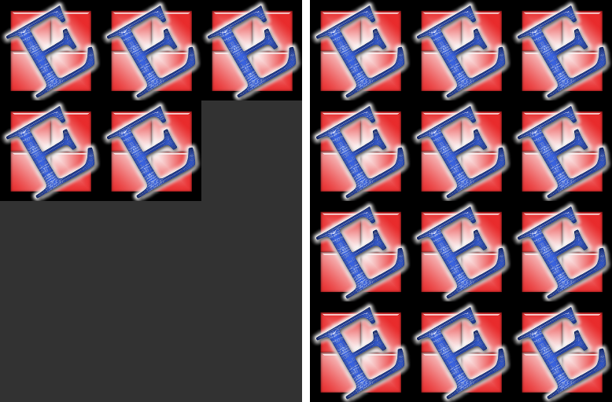

.. _Pixmap:

================
Pixmap
================

Pixmaps ("pixel maps") are objects at the heart of MuPDF's rendering capabilities. They represent plane rectangular sets of pixels. Each pixel is described by a number of bytes ("components") defining its color, plus an optional alpha byte defining its transparency.

In PyMuPDF, there exist several ways to create a pixmap. Except the first one, all of them are available as overloaded constructors. A pixmap can be created ...

1. from a document page (method :meth:`Page.getPixmap`)
2. empty, based on :ref:`Colorspace` and :ref:`IRect` information
3. from a file
4. from an in-memory image
5. from a memory area of plain pixels
6. from an image inside a PDF document
7. as a copy of another pixmap

.. note:: A number of image formats is supported as input for points 3. and 4. above. See section :ref:`ImageFiles`.

Have a look at the **example** section to see some pixmap usage "at work".

============================= ===================================================
**Method / Attribute**        **Short Description**
============================= ===================================================
:meth:`Pixmap.clearWith`      clear parts of a pixmap
:meth:`Pixmap.copyPixmap`     copy parts of another pixmap
:meth:`Pixmap.gammaWith`      apply a gamma factor to the pixmap
:meth:`Pixmap.getPNGData`     return a PNG as a memory area
:meth:`Pixmap.invertIRect`    invert the pixels of a given area
:meth:`Pixmap.setAlpha`       sets alpha values
:meth:`Pixmap.shrink`         reduce size keeping proportions
:meth:`Pixmap.tintWith`       tint a pixmap with a color
:meth:`Pixmap.writeImage`     save a pixmap in various formats
:meth:`Pixmap.writePNG`       save a pixmap as a PNG file
:attr:`Pixmap.alpha`          transparency indicator
:attr:`Pixmap.colorspace`     pixmap's :ref:`Colorspace`
:attr:`Pixmap.height`         pixmap height
:attr:`Pixmap.interpolate`    interpolation method indicator
:attr:`Pixmap.irect`          :ref:`IRect` of the pixmap
:attr:`Pixmap.n`              bytes per pixel
:attr:`Pixmap.samples`        pixel area
:attr:`Pixmap.size`           pixmap's total length
:attr:`Pixmap.stride`         size of one image row
:attr:`Pixmap.width`          pixmap width
:attr:`Pixmap.x`              X-coordinate of top-left corner
:attr:`Pixmap.xres`           resolution in X-direction
:attr:`Pixmap.y`              Y-coordinate of top-left corner
:attr:`Pixmap.yres`           resolution in Y-direction
============================= ===================================================

**Class API**

.. class:: Pixmap

   .. method:: __init__(self, colorspace, irect, alpha)

      **Empty pixmap:** Create an empty pixmap of size and origin given by a rectangle. So, for a ``fitz.IRect(x0, y0, x1, y1)``, ``fitz.Point(x0, y0)`` designates the top left corner of the pixmap. Note that the image area is **not initialized** and will contain crap data.

      :arg colorspace: colorspace of the pixmap.
      :type colorspace: :ref:`Colorspace`

      :arg irect: Tte pixmap's area and location.
      :type irect: :ref:`IRect`

      :arg bool alpha: Specifies whether transparency bytes should be included. Default is ``False``.

   .. method:: __init__(self, colorspace, source, [alpha])

      **Copy and set colorspace:** Copy ``source`` pixmap choosing the colorspace. Any colorspace combination is possible, but source colorspace must not be ``None``.

      :arg colorspace: desired target colorspace. This may also be ``None``. In this case, a "masking" pixmap is created: its :attr:`Pixmap.samples` will consist of the source's alpha bytes only.
      :type colorspace: :ref:`Colorspace`

      :arg source: the source pixmap.
      :type source: ``Pixmap``

      :arg bool alpha: whether to also copy the source's alpha channel. If the source has no alpha, this parameter has no effect. If ``False`` the result will have no alpha.

   .. method:: __init__(self, source, width, height, [clip])

      **Copy and scale:** Copy ``source`` pixmap choosing new width and height values. Supports partial copying and ``source.colorspace == None``.

      :arg source: the source pixmap.
      :type source: ``Pixmap``

      :arg float width: desired target width.

      :arg float height: desired target height.

      :arg clip: a region of the source pixmap to take the copy from.
      :type clip: :ref:`IRect`

   .. method:: __init__(self, source)

      **Copy and add alpha:** Identical copy from ``source`` with an added alpha channel. The alpha values are set to 255. The source colorspace must not be ``None``.

      :arg source: the source pixmap, must not have alpha.
      :type source: ``Pixmap``

   .. method:: __init__(self, filename)

      **From a file:** Create a pixmap from ``filename``. Image type and all properties are determined automatically.

      :arg str filename: Path / name of the file. The origin of the resulting pixmap is ``(0, 0)``.

   .. method:: __init__(self, img)

      **From memory:** Create a pixmap from bytearray ``img``. Image type and all properties are determined automatically.

      :arg bytearray img: Data containing a complete, valid image in one of the supported formats. Could have been created by something like ``img = bytearray(open('somepic.png', 'rb').read())``. The origin of the resulting pixmap is (0,0). Type ``bytes`` is **supported in Python 3** only, because ``string == bytes`` in Python 2 and hence will be treated as a filename.

   .. method:: __init__(self, colorspace, width, height, samples, alpha)

      **From plain pixels:** Create a pixmap from ``samples``. Each pixel must be represented by a number of bytes as controlled by the ``colorspace`` and ``alpha`` parameters. The origin of the resulting pixmap is (0,0). This method is useful when raw image data are provided by some other program - see examples below.

      :arg colorspace: Colorspace of the image. Together with ``alpha`` this parameter controls the interpretation of the ``samples`` area. The following must be true: ``(colorspace.n + alpha) * width * height == len(samples)``.
      :type colorspace: :ref:`Colorspace`

      :arg int width: image width

      :arg int height: image height

      :arg bytes samples:  an area containing all pixels of the image. Must include alpha values if specified. Type ``bytearray`` is also supported.

      :arg bool alpha: whether a transparency channel is included.

      .. caution:: The method will not make a copy of ``samples``, but rather record a pointer. Therefore make sure that it remains available throughout the lifetime of the pixmap. Otherwise the pixmap's image will likely be destroyed or even worse things will happen.

   .. method:: __init__(self, doc, xref)

      **From a PDF image:** Create a pixmap from an image **contained in PDF** ``doc`` identified by its XREF number. All pimap properties are set by the image.

      :arg doc: an opened **PDF** document.
      :type doc: :ref:`Document`

      :arg int xref: the XREF number of the image.

   .. method:: clearWith([value [, irect]])

      Initialize the samples area.

      :arg int value: if specified, values from 0 to 255 are valid. Each color byte of each pixel will be set to this value, while alpha will be set to 255 (non-transparent). If omitted, then all bytes including alpha are cleared to 0x00.

      :arg irect: the area to be cleared. Omit to clear the whole pixmap. Can only be specified, if ``value`` is also specified.
      :type irect: :ref:`IRect`

   .. method:: tintWith(red, green, blue)

      Colorize (tint) a pixmap with a color provided as an integer triple (red, green, blue). Only colorspaces :data:`CS_GRAY` and :data:`CS_RGB` are supported, others are ignored with a warning.

      If the colorspace is :data:`CS_GRAY`, ``(red + green + blue)/3`` will be taken as the tint value.

      :arg int red: ``red`` component.

      :arg int green: ``green`` component.

      :arg int blue: ``blue`` component.

   .. method:: gammaWith(gamma)

      Apply a gamma factor to a pixmap, i.e. lighten or darken it. Pixmaps with colorspace ``None`` are ignored with a warning.

      :arg float gamma: ``gamma = 1.0`` does nothing, ``gamma < 1.0`` lightens, ``gamma > 1.0`` darkens the image.

   .. method:: shrink(n)

      Shrink the pixmap by dividing both, its width and height by 2\ :sup:`n`.

      :arg int n: determines the new pixmap (samples) size. For example, a value of 2 divides width and height by 4 and thus results in a size of one 16\ :sup:`th` of the original. Values less than 1 are ignored with a warning.

      .. note:: Use this methods to reduce a pixmap's size retaining its proportion. The pixmap is changed "in place". If you want to keep original and also have more granular choices, use the resp. copy constructor above.

   .. method:: setAlpha([alphavalues])

      Change the alpha values. The pixmap must have an alpha channel.

      :arg bytes alphavalues: the new alpha values. Type ``bytearray`` is also permitted. If provided, its length must be at least ``width * height``. If omitted, all alpha values are to 255 (no transparency).

   .. method:: invertIRect(irect)

      Invert the color of all pixels in :ref:`IRect` ``irect``. Will have no effect if colorspace is ``None``.

      :arg irect: The area to be inverted. Omit to invert everything.
      :type irect: :ref:`IRect`

   .. method:: copyPixmap(source, irect)

      Copy the :ref:`IRect` part of ``source`` into the corresponding area of this one. The two pixmaps may have different dimensions and different colorspaces (provided each is either :data:`CS_GRAY` or :data:`CS_RGB`), but currently **must** have the same alpha property. The copy mechanism automatically adjusts discrepancies between source and target like so:

      If copying from :data:`CS_GRAY` to :data:`CS_RGB`, the source gray-shade value will be put into each of the three rgb component bytes. If the other way round, ``(r + g + b) / 3`` will be taken as the gray-shade value of the target.

      Between ``irect`` and the target pixmap's rectangle, an "intersection" is calculated at first. Then the corresponding data of this intersection are being copied. If this intersection is empty, nothing will happen.

      If you want your ``source`` pixmap image to land at a specific target position, set its ``x`` and ``y`` attributes to the top left point of the desired rectangle before copying. See the example below for how this works.

      :arg source: source pixmap.
      :type source: :ref:`Pixmap`

      :arg irect: The area to be copied.
      :type irect: :ref:`IRect`

   .. method:: writeImage(filename, output="png")

      Save pixmap as an image file. Depending on the output chosen, only some or all colorspaces are supported and different file extensions can be chosen. Please see the table below. Since MuPDF v1.10a the ``savealpha`` option is no longer supported and will be ignored with a warning.

      :arg str filename: The filename to save to. Depending on the chosen output format, possible file extensions are ``.pam``, ``.pbm``, ``.pgm``, ``ppm``, ``.pnm``, ``.png`` and ``.tga``.

      :arg str output: The requested image format. The default is ``png`` for which this function is equal to ``writePNG()``, see below. Other possible values are ``pam``, ``pnm`` and ``tga``.

   .. method:: writePNG(filename)

      Save the pixmap as a PNG file. Please note that only grayscale and RGB colorspaces are supported (this is **not** a MuPDF restriction). CMYK colorspaces must either be saved as ``*.pam`` files or be converted first.

      :arg str filename: The filename to save to (the extension ``png`` must be specified). Existing files will be overwritten without warning.

   .. method:: getPNGData()

      Like ``writePNG`` but returnes a bytearray instead.

      :rtype: bytearray

   .. attribute:: alpha

      Indicates whether the pixmap contains transparency information.

      :type: bool

   .. attribute:: colorspace

      The colorspace of the pixmap. This value may be ``None`` if the image is to be treated as a so-called *image mask* or *stencil mask* (currently happens for extracted PDF document images only).

      :type: :ref:`Colorspace`

   .. attribute:: stride

      Contains the length of one row of image data in ``samples``. This is primarily used for calculation purposes. The following expressions are true: ``len(samples) == height * stride``, ``width * n == stride``.

      :type: int

   .. attribute:: irect

      Contains the :ref:`IRect` of the pixmap.

      :type: :ref:`IRect`

   .. attribute:: samples

      The color and (if ``alpha == 1``) transparency values for all pixels. ``samples`` is a memory area of size ``width * height * n`` bytes. Each n bytes define one pixel. Each successive n bytes yield another pixel in scanline order. Subsequent scanlines follow each other with no padding. E.g. for an RGBA colorspace this means, ``samples`` is a sequence of bytes like ``..., R, G, B, A, ...``, and the four byte values R, G, B, A define one pixel.

      This area can be passed to other graphics libraries like PIL (Python Imaging Library) to do additional processing like saving the pixmap in other image formats. See example 3.

      :type: bytes

   .. attribute:: size

      Contains ``len(pixmap)``. This will generally equal ``len(pix.samples) + 60`` (32bit systems, the delta is 88 on 64bit machines).

      :type: int

   .. attribute:: width

   .. attribute:: w

      Width of the region in pixels.

      :type: int

   .. attribute:: height

   .. attribute:: h

      Height of the region in pixels.

      :type: int

   .. attribute:: x

      X-coordinate of top-left corner

      :type: int

   .. attribute:: y

      Y-coordinate of top-left corner

      :type: int

   .. attribute:: n

      Number of components per pixel. This number depends on colorspace and alpha. If colorspace is not ``None`` (stencil masks), then ``Pixmap.n - Pixmap.aslpha == pixmap.colorspace.n`` is true. If colorspace is ``None``, then ``n == alpha == 1``.

      :type: int

   .. attribute:: xres

      Horizontal resolution in dpi (dots per inch).

      :type: int

   .. attribute:: yres

      Vertical resolution in dpi.

      :type: int

   .. attribute:: interpolate

      An information-only boolean flag set to ``True`` if the image will be drawn using "linear interpolation". If ``False`` "nearest neighbour sampling" will be used.

      :type: bool

.. _ImageFiles:

Supported Input Image Types
-----------------------------------------------
The following file types are supported as input to construct pixmaps: **BMP, JPEG, GIF, TIFF, JXR,** and **PNG**. This support is two-fold:

1. Directly create a pixmap with ``Pixmap(filename)`` or ``Pixmap(byterray)``. The pixmap will then have properties as determined by the image.

2. Open such files with ``fitz.open(...)``. The result will then appear as a document containing one single page. Creating a pixmap of this page offers all options available in this context: apply a matrix, choose colorspace and alpha, confine the pixmap to a clip area, etc.

**SVG images** are only supported via method 2 above, not directly as pixmaps. This will turn the SVG into a raster image. If you need a **vector image** you must first convert it to a PDF and then display it e.g. via :meth:`Page.showPDFpage`. There exist many tools for SVG-to-PDF conversion, among them the Python package `svglib <https://pypi.org/project/svglib>`_ or Java solutions like `Apache Batik <https://github.com/apache/batik>`_. Have a look at our Wiki for examples.

Details on Saving Images with ``writeImage()``
-----------------------------------------------

.. |wimgopt| image:: img-writeimage.png

The following table shows possible combinations of file extensions, output formats and colorspaces of method ``writeImage()``:

|wimgopt|

.. note:: Not all image file types are available, or at least common on all platforms, e.g. PAM is mostly unknown on Windows. Especially pertaining to CMYK colorspaces, you can always convert a CMYK pixmap to an RGB pixmap with ``rgb_pix = fitz.Pixmap(fitz.csRGB, cmyk_pix)`` and then save that as a PNG.

Pixmap Example Code Snippets
-----------------------------

Example 1: Gluing Images
~~~~~~~~~~~~~~~~~~~~~~~~~

This shows how pixmaps can be used for purely graphical, non-PDF purposes. The script reads a PNG picture and creates a new PNG file which consist of 3 * 4 tiles of the original one:
::
 import fitz
 # create a pixmap of a picture
 pix0 = fitz.Pixmap("editra.png")

 # set target colorspace and pixmap dimensions and create it
 tar_width  = pix0.width * 3              # 3 tiles per row
 tar_height = pix0.height * 4             # 4 tiles per column
 tar_irect  = fitz.IRect(0, 0, tar_width, tar_height)
 # create empty target pixmap
 tar_pix    = fitz.Pixmap(fitz.csRGB, tar_irect, pix0.alpha)
 # clear target with a very lively stone-gray (thanks and R.I.P., Loriot)
 tar_pix.clearWith(90)

 # now fill target with 3 * 4 tiles of input picture
 for i in range(4):
     pix0.y = i * pix0.height                     # modify input's y coord
     for j in range(3):
         pix0.x = j * pix0.width                  # modify input's x coord
         tar_pix.copyPixmap(pix0, pix0.irect)     # copy input to new loc
         # save all intermediate images to show what is happening
         fn = "target-%i-%i.png" % (i, j)
         tar_pix.writePNG(fn) 

.. |editra| image:: img-editra.png

This is the input picture ``editra.png`` (taken from the wxPython directory ``/tools/Editra/pixmaps``):

|editra|

Here is the output, showing some intermediate picture and the final result:

|target|

Example 2: Interfacing with NumPy
~~~~~~~~~~~~~~~~~~~~~~~~~~~~~~~~~

This shows how to create a PNG file from a numpy array (several times faster than most other methods):
::
 import numpy as np
 import fitz
 #==============================================================================
 # create a fun-colored width * height PNG with fitz and numpy
 #==============================================================================
 height = 150
 width  = 100
 bild = np.ndarray((height, width, 3), dtype=np.uint8)

 for i in range(height):
     for j in range(width):
         # one pixel (some fun coloring)
         bild[i, j] = [(i+j)%256, i%256, j%256]

 samples = bytearray(bild.tostring())    # get plain pixel data from numpy array
 pix = fitz.Pixmap(fitz.csRGB, width, height, samples, alpha=False)
 pix.writePNG("test.png")

Example 3: Interfacing with PIL / Pillow
~~~~~~~~~~~~~~~~~~~~~~~~~~~~~~~~~~~~~~~~~

This shows how to interface with ``PIL / Pillow`` (the Python Imaging Library), thereby extending the reach of image files that can be processed:

>>> import fitz
>>> from PIL import Image
>>> pix = fitz.Pixmap(...)
>>> ...
>>> # create and save a PIL image
>>> img = Image.frombytes("RGB", [pix.width, pix.height], pix.samples)
>>> img.save(filename, 'jpeg')
>>> ...
>>> # opposite direction:
>>> # create a pixmap from any PIL-supported image file "some_image.xxx"
>>> img = Image.open("some_image.xxx").convert("RGB")
>>> samples = img.tobytes()
>>> pix = fitz.Pixmap(fitz.csRGB, img.size[0], img.size[1], samples, alpha=False)

Example 4: Extracting Alpha Values, Making Stencil Masks
~~~~~~~~~~~~~~~~~~~~~~~~~~~~~~~~~~~~~~~~~~~~~~~~~~~~~~~~~

If ``pix`` is a pixmap with transparency attributes, a copy using ``None`` as the target colorspace, will extract the alpha values and thus create a "mask" pixmap. Which means ``mask.n = mask.alpha = 1`` and ``mask.colorspace = None``. 

>>> pix
fitz.Pixmap(DeviceRGB, fitz.IRect(0, 0, 1168, 823), 1)
>>> pix.n
4
>>> mask = fitz.Pixmap(None, pix)
>>> # now mask.samples will contain the alpha values of pix:
>>> mask
fitz.Pixmap(None, fitz.IRect(0, 0, 1168, 823), 1)
>>> mask.n
1

Example 4: Converting Stencil Masks
~~~~~~~~~~~~~~~~~~~~~~~~~~~~~~~~~~~

Pixmaps created from stencil / image masks cannot be copied to a "normal" pixmap directly. But they can be written out to PNG image files. Use this fact to create a conventional pixmap like so:

>>> mask                       # stencil mask from previous example
fitz.Pixmap(None, fitz.IRect(0, 0, 1168, 823), 1)
>>> pix = fitz.Pixmap(mask.getPNGData())
>>> pix
fitz.Pixmap(DeviceGRAY, fitz.IRect(0, 0, 1168, 823), 0)
