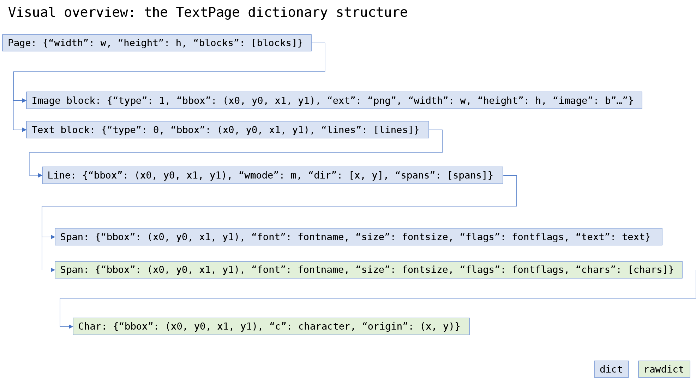

.. _TextPage:

================
TextPage
================

This class represents text and images shown on a document page. All MuPDF document types are supported.

=============================== ==============================================
**Method**                      **Short Description**
=============================== ==============================================
:meth:`TextPage.extractText`    Extract the page's plain text
:meth:`TextPage.extractTEXT`    synonym of previous
:meth:`TextPage.extractHTML`    Extract the page's content in HTML format
:meth:`TextPage.extractJSON`    Extract the page's content in JSON format
:meth:`TextPage.extractXHTML`   Extract the page's content in XHTML format
:meth:`TextPage.extractXML`     Extract the page's text in XML format
:meth:`TextPage.extractDICT`    Extract the page's content in *dict* format
:meth:`TextPage.extractRAWDICT` Extract the page's content in *dict* format
:meth:`TextPage.search`         Search for a string in the page
=============================== ==============================================

**Class API**

.. class:: TextPage

   .. method:: extractText

   .. method:: extractTEXT

      Extract all text from a ``TextPage`` object. Returns a string of the page's complete text. The text is UTF-8 unicode and in the same sequence as specified at the time of document creation.

      :rtype: str

   .. method:: extractHTML

      Extract all text and images in HTML format. This version contains complete formatting and positioning information. Images are included (encoded as base64 strings). You need an HTML package to interpret the output in Python. Your internet browser should be able to adequately display this information, but see :ref:`HTMLQuality`.

      :rtype: str

   .. method:: extractDICT

      Extract content as a Python dictionary. Provides same information detail as HTML. See below for the structure.

      :rtype: dict

   .. method:: extractJSON

      Extract content as a string in JSON format. Created by  ``json.dumps(TextPage.extractDICT())``. It is included only for backlevel compatibility. You will probably use this method ever only for outputting the result in some text file or the like.

      :rtype: str

   .. method:: extractXHTML

      Extract all text in XHTML format. Text information detail is comparable with :meth:`extractTEXT`, but also contains images (base64 encoded). This method makes no attempt to re-create the original visual appearance.

      :rtype: str

   .. method:: extractXML

      Extract all text in XML format. This contains complete formatting information about every single character on the page: font, size, line, paragraph, location, etc. Contains no images. You need an XML package to interpret the output in Python.

      :rtype: str

   .. method:: extractRAWDICT

      Extract content as a Python dictionary -- technically similar to :meth:`extractDICT`, and it contains that information as a subset (including any images). It provides additional detail down to each character, which makes using XML obsolete in many cases. See below for the structure.

      :rtype: dict

   .. method:: search(string, hit_max = 16, quads = False)

      Search for ``string`` and return a list of found locations.

      :arg str string: the string to search for.
      :arg int hit_max: maximum number of accepted hits (default 16).
      :arg bool quads: return quadrilaterals instead of rectangles.
      :rtype: list
      :returns: a list of :ref:`Rect` or :ref:`Quad` objects, each surrounding a found ``string`` occurrence.

      Example: If the search for string "pymupdf" contains a hit like shown, then the corresponding entry will either be the blue rectangle, or, if ``quads`` was specified, ``Quad(ul, ur, ll, lr)``.

      .. image:: img-quads.jpg

   .. note:: All of the above can be achieved by using the appropriate :meth:`Page.getText` and :meth:`Page.searchFor` methods. Also see further down and in the :ref:`Page` chapter for examples on how to create a valid file format by adding respective headers and trailers.

Dictionary Structure of :meth:`extractDICT` and :meth:`extractRAWDICT`
-------------------------------------------------------------------------

Page Dictionary
~~~~~~~~~~~~~~~~~
=============== ============================================
Key             Value
=============== ============================================
width           page width in pixels *(float)*
height          page height in pixels *(float)*
blocks          *list* of block dictionaries
=============== ============================================

Block Dictionaries
~~~~~~~~~~~~~~~~~~
Blocks come in two different formats: **image blocks** and **text blocks**.

**Image block:**

=============== ===============================================================
Key             Value
=============== ===============================================================
type            1 = image *(int)*
bbox            block / image rectangle, formatted as ``tuple(fitz.Rect)``
ext             image type *(str)*, as its file extension, see below
width           original image width *(float)*
height          original image height *(float)*
image           image content *(bytes/bytearray)*
=============== ===============================================================

Possible values of key ``"ext"`` are ``"bmp"``, ``"gif"``, ``"jpeg"``, ``"jpx"`` (JPEG 2000), ``"jxr"`` (JPEG XR), ``"png"``, ``"pnm"``, and ``"tiff"``.

.. note:: All of the above values may be zero or contain empty objects respectively. In an effort to provide complete information we may return entries like ``{'type': 1, 'bbox': [0.0, 0.0, 0.0, 0.0], 'width': 0, 'height': 0, 'ext': 'png', 'image': b''}``.

**Text block:**

=============== ====================================================
Key             Value
=============== ====================================================
type            0 = text *(int)*
bbox            block rectangle, formatted as ``tuple(fitz.Rect)``
lines           *list* of text line dictionaries
=============== ====================================================

Line Dictionary
~~~~~~~~~~~~~~~~~

=============== =====================================================
Key             Value
=============== =====================================================
bbox            line rectangle, formatted as ``tuple(fitz.Rect)``
wmode           writing mode *(int)*: 0 = horizontal, 1 = vertical
dir             writing direction *(list of floats)*: ``[x, y]``
spans           *list* of span dictionaries
=============== =====================================================

The value of key ``"dir"`` is a **unit vetor** and should be interpreted as follows:

* ``x``: positive = "left-right", negative = "right-left", 0 = neither
* ``y``: positive = "top-bottom", negative = "bottom-top", 0 = neither

The values indicate the "relative writing speed" in each direction, such that x\ :sup:`2` + y\ :sup:`2` = 1. In other words ``dir = [cos(beta), sin(beta)]``, where ``beta`` is the writing angle relative to the horizontal.

Span Dictionary
~~~~~~~~~~~~~~~~~

Spans contain the actual text. In contrast to MuPDF versions prior to v1.12, a span no longer includes positioning information. Therefore, to reconstruct the text of a line, the text pieces of all spans must be concatenated. A span since v1.12 also contains font information. A line contains **more than one span only**, if it contains text with different font properties.

.. versionchanged:: 1.14.17
    Spans now also have a ``bbox`` key (again).

=============== =====================================================================
Key             Value
=============== =====================================================================
bbox            span rectangle, formatted as ``tuple(fitz.Rect)``
font            font name *(str)*
size            font size *(float)*
flags           font characteristics *(int)*
text            (only for :meth:`extractDICT`) text *(str)*
chars           (only for :meth:`extractRAWDICT`) *list* of character dictionaries
=============== =====================================================================

``flags`` is an integer, encoding bools of font properties:

* bit 0: superscripted (2\ :sup:`0`)
* bit 1: italic (2\ :sup:`1`)
* bit 2: serifed (2\ :sup:`2`)
* bit 3: monospaced (2\ :sup:`3`)
* bit 4: bold (2\ :sup:`4`)

Test these characteristics like so:

>>> if flags & 2**0: print("super")
>>> if flags & 2**1: print("italic")
>>> if flags & 2**2: print("serif")
>>> # etc.
>>>

Character Dictionary for :meth:`extractRAWDICT`
~~~~~~~~~~~~~~~~~~~~~~~~~~~~~~~~~~~~~~~~~~~~~~~~

=============== ========================================================
Key             Value
=============== ========================================================
bbox            character rectangle, formatted as ``tuple(fitz.Rect)``
c               the character (unicode)
origin          *tuple* coordinates of the bottom left point
=============== ========================================================

