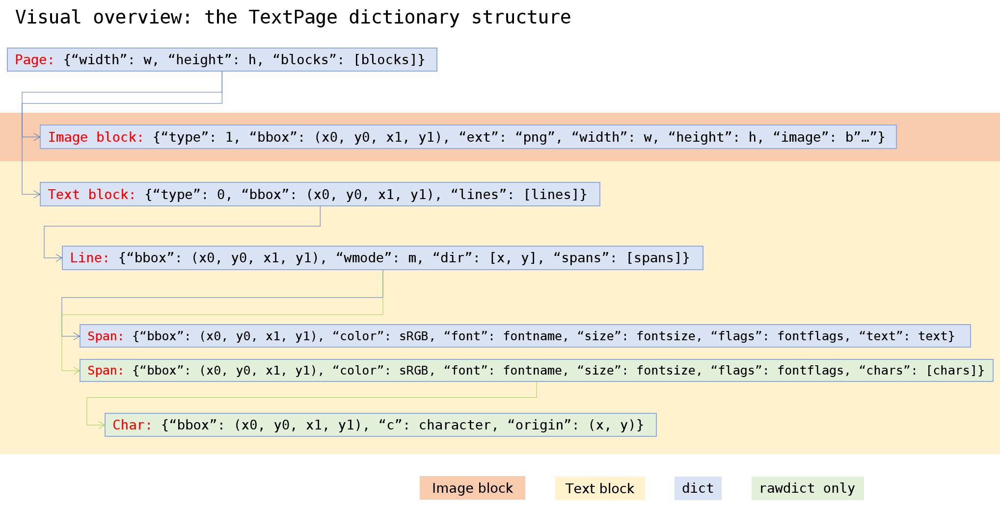

.. _TextPage:

================
TextPage
================

This class represents text and images shown on a document page. All MuPDF document types are supported.

The usual way to create a textpage is :meth:`DisplayList.getTextPage`. Because there is a limited set of methods in this class, there exist higher level shortcut methods in the :ref:`Page` class, which incorporate creating an intermediate :ref:`DisplayList` and then invoke one of the following methods. The last column of this table shows these corresponding :ref:`Page` methods.

For a description of what this class is all about, see Appendix 2.

======================== ================================ ======================
**Method**               **Description**                  :ref:`Page` method
======================== ================================ ======================
:meth:`~.extractText`    extract plain text               ``getText("text")``
:meth:`~.extractTEXT`    synonym of previous              ``getText("text")``
:meth:`~.extractBLOCKS`  plain text grouped in blocks     ``getText("blocks")``
:meth:`~.extractWORDS`   all words with their bbox        ``getText("words")``
:meth:`~.extractHTML`    page content in HTML format      ``getText("html")``
:meth:`~.extractJSON`    page content in JSON format      ``getText("json")``
:meth:`~.extractXHTML`   page content in XHTML format     ``getText("xhtml")``
:meth:`~.extractXML`     page text in XML format          ``getText("xml")``
:meth:`~.extractDICT`    page content in *dict* format    ``getText("dict")``
:meth:`~.extractRAWDICT` page content in *dict* format    ``getText("rawdict")``
:meth:`~.search`         Search for a string in the page  ``searchFor()``
======================== ================================ ======================

**Class API**

.. class:: TextPage

   .. method:: extractText

   .. method:: extractTEXT

      Return a string of the page's complete text. The text is UTF-8 unicode and in the same sequence as specified at the time of document creation.

      :rtype: str

   .. method:: extractBLOCKS

      Textpage content as a list of text lines grouped by block. Each list items looks like this::

         (x0, y0, x1, y1, "lines in blocks", block_type, block_no)

      The first four entries are the block's bbox coordinates, ``block_type`` is 1 for an image block, 0 for text. ``block_no`` is the block sequence number.

      For an image block, its bbox and a text line with image meta information is included -- not the image data itself.

      This is a high-speed method with enough information to rebuild a desired text sequence.

      :rtype: list

   .. method:: extractWORDS

      Textpage content as a list of single words with bbox information. An item of this list looks like this::

         (x0, y0, x1, y1, "word", block_no, line_no, word_no)

      Everything wrapped in spaces is treated as a *"word"* with this method.

      This is a high-speed method which e.g. allows extracting text from within a given rectangle.

      :rtype: list

   .. method:: extractHTML

      Textpage content in HTML format. This version contains complete formatting and positioning information. Images are included (encoded as base64 strings). You need an HTML package to interpret the output in Python. Your internet browser should be able to adequately display this information, but see :ref:`HTMLQuality`.

      :rtype: str

   .. method:: extractDICT

      Textpage content as a Python dictionary. Provides same information detail as HTML. See below for the structure.

      :rtype: dict

   .. method:: extractJSON

      Textpage content in JSON format. Created by  ``json.dumps(TextPage.extractDICT())``. It is included only for backlevel compatibility. You will probably use this method ever only for outputting the result in some file.

      :rtype: str

   .. method:: extractXHTML

      Textpage content in XHTML format. Text information detail is comparable with :meth:`extractTEXT`, but also contains images (base64 encoded). This method makes no attempt to re-create the original visual appearance.

      :rtype: str

   .. method:: extractXML

      Textpage content in XML format. This contains complete formatting information about every single character on the page: font, size, line, paragraph, location, color, etc. Contains no images. You probably need an XML package to interpret the output in Python.

      :rtype: str

   .. method:: extractRAWDICT

      Textpage content as a Python dictionary -- technically similar to :meth:`extractDICT`, and it contains that information as a subset (including any images). It provides additional detail down to each character, which makes using XML obsolete in many cases. See below for the structure.

      :rtype: dict

   .. method:: search(string, hit_max = 16, quads = False)

      Search for ``string`` and return a list of found locations.

      :arg str string: the string to search for. Upper / lower cases will all match.
      :arg int hit_max: maximum number of returned hits (default 16).
      :arg bool quads: return quadrilaterals instead of rectangles.
      :rtype: list
      :returns: a list of :ref:`Rect` or :ref:`Quad` objects, each surrounding a found ``string`` occurrence. The search string may contain spaces, it may therefore happen, that its parts are located on different lines. In this case, more than one rectangle (quadrilateral) are returned. The method does **not support hyphenation**, so it will not find "meth-od" when searching for "method".

      Example: If the search for string "pymupdf" contains a hit like shown, then the corresponding entry will either be the blue rectangle, or, if ``quads`` was specified, ``Quad(ul, ur, ll, lr)``.

      .. image:: images/img-quads.jpg

.. _textpagedict:

Dictionary Structure of :meth:`extractDICT` and :meth:`extractRAWDICT`
-------------------------------------------------------------------------

Page Dictionary
~~~~~~~~~~~~~~~~~
=============== ============================================
**Key**         **Value**
=============== ============================================
width           page width in pixels *(float)*
height          page height in pixels *(float)*
blocks          *list* of block dictionaries
=============== ============================================

Block Dictionaries
~~~~~~~~~~~~~~~~~~
Blocks come in two different formats: **image blocks** and **text blocks**.

**Image block:**

=============== ===============================================================
**Key**             **Value**
=============== ===============================================================
type            1 = image *(int)*
bbox            block / image rectangle, formatted as ``tuple(fitz.Rect)``
ext             image type *(str)*, as its file extension, see below
width           original image width *(float)*
height          original image height *(float)*
image           image content *(bytes/bytearray)*
=============== ===============================================================

Possible values of key ``"ext"`` are ``"bmp"``, ``"gif"``, ``"jpeg"``, ``"jpx"`` (JPEG 2000), ``"jxr"`` (JPEG XR), ``"png"``, ``"pnm"``, and ``"tiff"``.

.. note::

   1. In some error situations, all of the above values may be zero or contain empty objects respectively. So, please be prepared to cope with items like

      ``{'type': 1, 'bbox': (0.0, 0.0, 0.0, 0.0), 'width': 0, 'height': 0, 'ext': 'png', 'image': b''}``

   2. For PDF documents, the image blocks returned with this method **may or may not** be the same set as the entries contained in :meth:`Page.getImageList`. If there are differences, they most probably are caused by one of the following:

       - "inline" images (see page 352 of the :ref:`AdobeManual`) are detected by this method, but **not by** :meth:`Page.getImageList`.
       - images named in the page :data:`object` definition **always** appear in :meth:`Page.getImageList`. But if a corresponding "display" command in the page's ``/Contents`` is missing (erroneously or on purpose), they will **not appear** as one of the block dictionaries.

**Text block:**

=============== ====================================================
**Key**             **Value**
=============== ====================================================
type            0 = text *(int)*
bbox            block rectangle, formatted as ``tuple(fitz.Rect)``
lines           *list* of text line dictionaries
=============== ====================================================

Line Dictionary
~~~~~~~~~~~~~~~~~

=============== =====================================================
**Key**             **Value**
=============== =====================================================
bbox            line rectangle, formatted as ``tuple(fitz.Rect)``
wmode           writing mode *(int)*: 0 = horizontal, 1 = vertical
dir             writing direction *(list of floats)*: ``[x, y]``
spans           *list* of span dictionaries
=============== =====================================================

The value of key ``"dir"`` is a **unit vetor** and should be interpreted as follows:

* ``x``: positive = "left-right", negative = "right-left", 0 = neither
* ``y``: positive = "top-bottom", negative = "bottom-top", 0 = neither

The values indicate the "relative writing speed" in each direction, such that x\ :sup:`2` + y\ :sup:`2` = 1. In other words ``dir = [cos(beta), sin(beta)]``, where ``beta`` is the writing angle relative to the horizontal.

Span Dictionary
~~~~~~~~~~~~~~~~~

Spans contain the actual text. A line contains **more than one span only**, if it contains text with different font properties.

.. versionchanged:: 1.14.17
    Spans now also have a ``bbox`` key (again).

=============== =====================================================================
**Key**             **Value**
=============== =====================================================================
bbox            span rectangle, formatted as ``tuple(fitz.Rect)``
font            font name *(str)*
size            font size *(float)*
flags           font characteristics *(int)*
color           text color in sRGB format *(int)*
text            (only for :meth:`extractDICT`) text *(str)*
chars           (only for :meth:`extractRAWDICT`) *list* of character dictionaries
=============== =====================================================================

.. versionadded:: 1.16.0 ``"color"`` is the text color encoded in sRGB format, e.g. 0xFF0000 for red.

``"flags"`` is an integer, encoding bools of font properties:

* bit 0: superscripted (2\ :sup:`0`)
* bit 1: italic (2\ :sup:`1`)
* bit 2: serifed (2\ :sup:`2`)
* bit 3: monospaced (2\ :sup:`3`)
* bit 4: bold (2\ :sup:`4`)

Test these characteristics like so:

>>> if flags & 2**1: print("italic")
>>> # etc.

Character Dictionary for :meth:`extractRAWDICT`
~~~~~~~~~~~~~~~~~~~~~~~~~~~~~~~~~~~~~~~~~~~~~~~~
We are currently providing the bbox in :data:`rect_like` format. In a future version, we might change that to :data:`quad_like`. This image shows the relationship between items in the following table: |textpagechar|

.. |textpagechar| image:: images/img-textpage-char.png
   :align: top
   :scale: 66

=============== =========================================================
**Key**             **Value**
=============== =========================================================
origin          *tuple* coordinates of the character's bottom left point
bbox            character rectangle, formatted as ``tuple(fitz.Rect)``
c               the character (unicode)
=============== =========================================================

